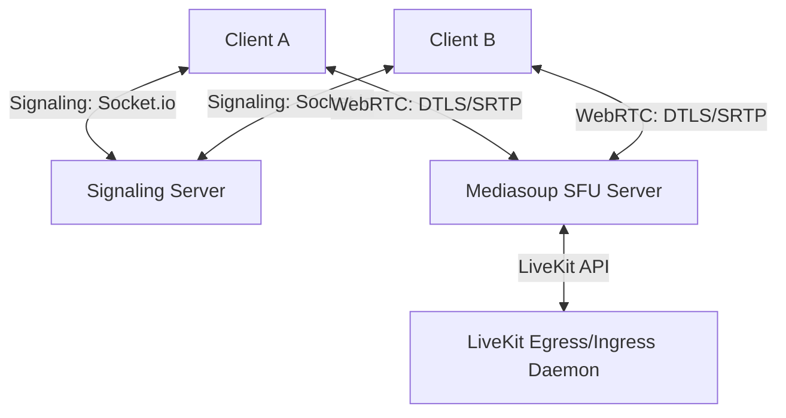

# AEGIS CONNECT - Enterprise Messaging & Meetings Platform
## Technical Architecture Blueprint

This document specifies the server, network, smart contract, database, and deployment specifications for the production implementation of the Aegis Connect Enterprise Messaging & Meetings ecosystem.

---

## 1. WebRTC & Media Infrastructure

To support high-quality voice lounges and group video conferences, Aegis Connect utilizes a hybrid **SFU (Selective Forwarding Unit)** and **Mesh** network architecture.



### Media Engine Specs
1. **Mediasoup SFU (Recommended for custom Web3 integrations)**:
   - Mediasoup runs as a Node.js library interfacing with C++ sub-processes.
   - It routes media packets directly over RTP without transcoding, optimizing server CPU performance.
   - Deployed on workers pinned to specific CPU cores to ensure low latency.
2. **LiveKit Integration**:
   - LiveKit coordinates token generation and webhook signals, mapping channels automatically.
   - Handles media recording egress, pushing records directly to IPFS for persistent trust auditing.
3. **Jitsi Integration**:
   - Used as a fallback option for public town halls and large-scale webinars.

---

## 2. Smart Contract Architectures

ATT (Verifiable Attendance Tokens) and meeting metadata verification are secured via smart contracts deployed on the **Aegis Chain (Polygon Subnet)**.

### Solidity Smart Contract Definition
```solidity
// SPDX-License-Identifier: MIT
pragma solidity ^0.8.20;

import "@openzeppelin/contracts/access/AccessControl.sol";

contract AegisMeetingRegistry is AccessControl {
    bytes32 public constant REGISTRAR_ROLE = keccak256("REGISTRAR_ROLE");

    struct Record {
        bytes32 meetingHash;
        string metadataCID; // IPFS hash containing meeting transcripts & action items
        bytes32 attendanceRoot; // Merkle root hash of participant DID signatures
        uint256 blockTimestamp;
        bool verified;
    }

    mapping(bytes32 => Record) public registry;

    event MeetingAttested(
        bytes32 indexed meetingHash,
        string metadataCID,
        bytes32 attendanceRoot
    );

    constructor(address admin) {
        _grantRole(DEFAULT_ADMIN_ROLE, admin);
        _grantRole(REGISTRAR_ROLE, admin);
    }

    function recordMeeting(
        bytes32 _meetingHash,
        string calldata _metadataCID,
        bytes32 _attendanceRoot
    ) external onlyRole(REGISTRAR_ROLE) {
        require(!registry[_meetingHash].verified, "Meeting already recorded");

        registry[_meetingHash] = Record({
            meetingHash: _meetingHash,
            metadataCID: _metadataCID,
            attendanceRoot: _attendanceRoot,
            blockTimestamp: block.timestamp,
            verified: true
        });

        emit MeetingAttested(_meetingHash, _metadataCID, _attendanceRoot);
    }
}
```

---

## 3. Database Schema

Aegis Connect uses a high-performance **PostgreSQL** layout to handle relational messages and audit ledgers.

```sql
-- Core Accounts & Profiles
CREATE TABLE users (
    id VARCHAR(64) PRIMARY KEY,
    name VARCHAR(255) NOT NULL,
    email VARCHAR(255) UNIQUE NOT NULL,
    role VARCHAR(32) CHECK (role IN ('student', 'faculty', 'hod', 'admin')),
    avatar_url TEXT,
    presence VARCHAR(32) DEFAULT 'offline' CHECK (presence IN ('online', 'offline', 'busy', 'meeting', 'presenting'))
);

-- Messaging Channels & Groups
CREATE TABLE rooms (
    id VARCHAR(64) PRIMARY KEY,
    name VARCHAR(255) NOT NULL,
    category VARCHAR(32) CHECK (category IN ('personal', 'faculty', 'student', 'department', 'class', 'research', 'placement', 'club')),
    created_at TIMESTAMP DEFAULT CURRENT_TIMESTAMP
);

-- Messages Ledger
CREATE TABLE messages (
    id VARCHAR(64) PRIMARY KEY,
    room_id VARCHAR(64) REFERENCES rooms(id) ON DELETE CASCADE,
    sender_id VARCHAR(64) REFERENCES users(id) ON DELETE CASCADE,
    content TEXT NOT NULL,
    reply_to_id VARCHAR(64) REFERENCES messages(id) ON DELETE SET NULL,
    file_name VARCHAR(255),
    file_url TEXT,
    has_poll BOOLEAN DEFAULT FALSE,
    created_at TIMESTAMP DEFAULT CURRENT_TIMESTAMP
);

-- Blockchain meeting records
CREATE TABLE meeting_records (
    id VARCHAR(64) PRIMARY KEY,
    room_id VARCHAR(64) REFERENCES rooms(id) ON DELETE CASCADE,
    host_id VARCHAR(64) REFERENCES users(id) ON DELETE CASCADE,
    meeting_hash VARCHAR(66) UNIQUE, -- SHA-256 Transaction Hash
    ipfs_cid VARCHAR(60), -- IPFS payload link
    attendance_root VARCHAR(66),
    block_number BIGINT,
    created_at TIMESTAMP DEFAULT CURRENT_TIMESTAMP
);
```

---

## 4. Socket.IO Signaling Server Architecture

The signaling server coordinates WebRTC handshake messages (SDP Offers, Answers, and ICE candidates).

```javascript
const io = require('socket.io')(httpServer, {
  cors: { origin: "*" }
});

io.on('connection', (socket) => {
  console.log(`Socket joined: ${socket.id}`);

  socket.on('join-room', ({ roomId, userId }) => {
    socket.join(roomId);
    socket.to(roomId).emit('user-connected', { userId, socketId: socket.id });
  });

  socket.on('webrtc-offer', ({ offer, targetSocketId }) => {
    socket.to(targetSocketId).emit('webrtc-offer', { offer, senderSocketId: socket.id });
  });

  socket.on('webrtc-answer', ({ answer, targetSocketId }) => {
    socket.to(targetSocketId).emit('webrtc-answer', { answer, senderSocketId: socket.id });
  });

  socket.on('ice-candidate', ({ candidate, targetSocketId }) => {
    socket.to(targetSocketId).emit('ice-candidate', { candidate, senderSocketId: socket.id });
  });

  socket.on('disconnecting', () => {
    for (const room of socket.rooms) {
      socket.to(room).emit('user-disconnected', { socketId: socket.id });
    }
  });
});
```

---

## 5. Kubernetes Cluster Deployment

Production configuration for running signaling and SFU servers inside a **Kubernetes (k8s)** namespace.

```yaml
apiVersion: apps/v1
kind: Deployment
metadata:
  name: aegis-mediasoup-sfu
  namespace: aegis-connect
spec:
  replicas: 3
  selector:
    matchLabels:
      app: mediasoup-sfu
  template:
    metadata:
      labels:
        app: mediasoup-sfu
    spec:
      containers:
      - name: sfu-engine
        image: aegis-registry.university.edu/connect/sfu:latest
        ports:
        - containerPort: 3000 # HTTP API
        - containerPort: 40000 # RTP Ports range start
          protocol: UDP
        env:
        - name: NODE_ENV
          value: "production"
        - name: MIN_PORT
          value: "40000"
        - name: MAX_PORT
          value: "40100"
 resource:
          limits:
            cpu: "2"
            memory: 4Gi
          requests:
            cpu: "1"
            memory: 2Gi
---
apiVersion: v1
kind: Service
metadata:
  name: sfu-service
  namespace: aegis-connect
spec:
  ports:
  - name: api
    port: 3000
    targetPort: 3000
  selector:
    app: mediasoup-sfu
  type: ClusterIP
```
