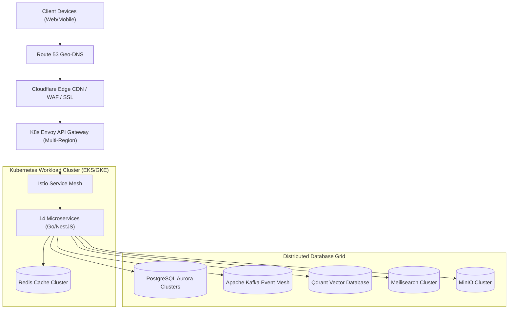
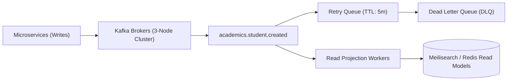
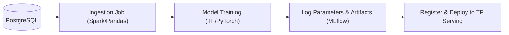
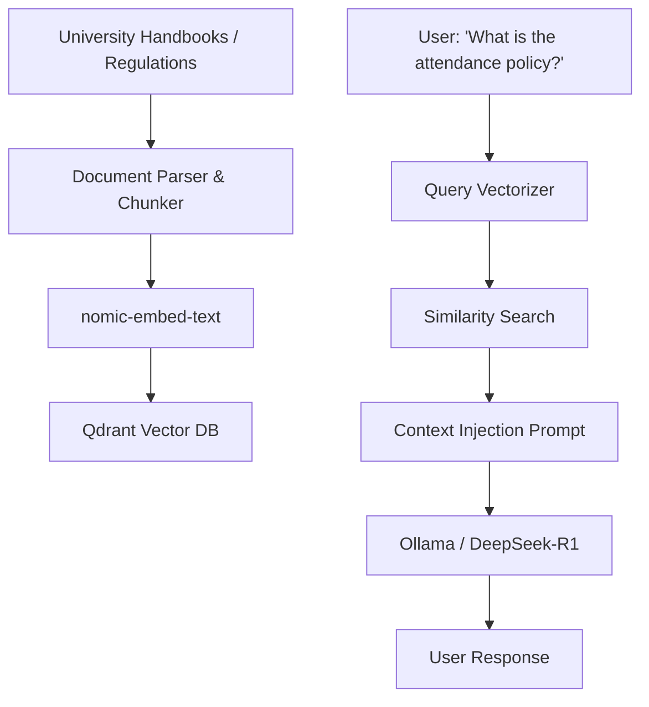
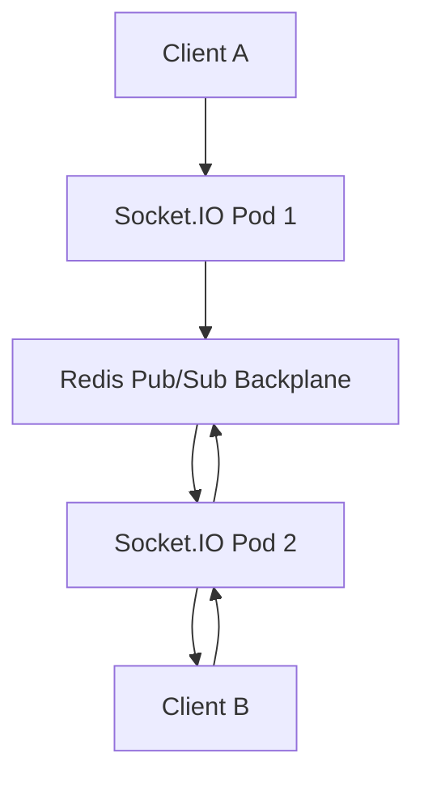

# Aegis University Operating System: 100x High-Scale Architecture Specification
**Document Version:** 2.0.0-PROD  
**Scale Target:** 1,000,000+ Concurrent Users  
**Status:** Approved for Implementation

---

## 1. Enterprise Architecture Diagram

The 100x architecture uses a multi-region, active-active edge deployment to ensure low latency and high availability.



---

## 2. Kubernetes Cluster Design

The infrastructure is orchestrated using high-availability Kubernetes clusters (K3s for development/staging, EKS/GKE for production).

* **Ingress Router**: Envoy proxy with Traefik ingress controllers.
* **Service Mesh**: Istio handles mutual TLS (mTLS) between services, circuit breakers, and traffic mirroring.
* **Autoscaling (HPA)**: Pods scale automatically based on both CPU utilization (threshold: 75%) and custom Prometheus metrics (e.g., HTTP request concurrency).
* **Load Balancing**: AWS ALB/NLB integrated directly via Kubernetes Ingress resources.

---

## 3. Microservice Architecture

Aegis is composed of 14 core services. Each service is fully decoupled, runs in its own container namespace, and implements Hexagonal Architecture.

```text
+-----------------------+-----------------------+-----------------------+
|     Auth Service      |    Student Service    |    Faculty Service    |
+-----------------------+-----------------------+-----------------------+
|  Attendance Service   |    Course Service     |     Exam Service      |
+-----------------------+-----------------------+-----------------------+
|    Finance Service    |     Chat Service      |      AI Service       |
+-----------------------+-----------------------+-----------------------+
|   Analytics Service   |    Search Service     | Notification Service  |
+-----------------------+-----------------------+-----------------------+
|   Placement Service   |    Library Service    |                       |
+-----------------------+-----------------------+-----------------------+
```

Each service communicates internally using high-performance **gRPC over HTTP/2** and broadcasts state changes asynchronously via Kafka.

---

## 4. Kafka Event Architecture

Apache Kafka acts as the event streaming backbone for all microservices, enabling Event Sourcing and CQRS patterns.



### Kafka Topics Specs
* **Replication Factor**: 3 (Cross-AZ replication)
* **Partitions**: 12 per topic (enabling parallel consumer scaling)
* **Queue Strategy**: Every topic is paired with a `.retry` queue and a `.dlq` (Dead Letter Queue) topic. Failed consumer processing is retried 3 times with exponential backoff before routing to the DLQ for operator inspection.

---

## 5. Database Architecture

To support 1,000,000+ students, the relational database relies on **PostgreSQL Aurora Serverless v2** with strict tenant isolation.

* **Tenant Segregation**: Mega-universities get dedicated PostgreSQL server instances. Standard universities use a schema-per-tenant model to isolate data, while small institutions use a shared-schema model isolated by Postgres **Row-Level Security (RLS)**.
* **Read-Write Splitting**: Writes are sent to a Primary database instance. Reads are distributed across a pool of regional read replicas through PgBouncer connection managers.

---

## 6. CQRS Design

Commands and Queries are completely segregated to maintain sub-100ms response times for reads:

* **Command Path**: Writes (e.g., student admission) update the PostgreSQL transactional store, which acts as the source of truth.
* **Query Path**: Reads (e.g., student profile search) query a read-optimized Meilisearch or Redis database.
* **Synchronization**: PostgreSQL updates trigger Kafka events via Debezium CDC (Change Data Capture), which update the read models asynchronously.

---

## 7. Event Sourcing Design

For auditing and transcript generation, the grading and transaction histories are implemented using **Event Sourcing**:

```json
{
  "aggregate_id": "student_0987654321",
  "aggregate_type": "StudentAcademicProfile",
  "version": 4,
  "event_type": "GradePublishedEvent",
  "payload": {
    "course_code": "CS302",
    "grade_letter": "A",
    "marks": 94.5,
    "blockchain_tx": "0x4f3e67..."
  },
  "timestamp": "2026-06-12T12:54:14Z"
}
```

Aggregate states are computed by reading the baseline snapshot and replaying all subsequent events from the Kafka Event Store.

---

## 8. TensorFlow Architecture

Aegis deploys custom machine learning models to detect student risk and predict placement probability.

* **Model Registry**: Models are packaged, versioned, and stored in an S3-compatible MinIO bucket.
* **Inference Serving**: Models are hosted using **TensorFlow Serving** pods in the Kubernetes cluster.
* **Scale**: Pods scale horizontally on custom GPU/CPU metrics to handle peak batch prediction loads (e.g., after final exams).

---

## 9. ML Pipeline Design



The ML lifecycle is managed automatically. Once a training pipeline completes, its metadata, accuracy scores, and weights are registered in MLflow. If performance beats the current production model, the deployment pipeline triggers rolling updates in Kubernetes.

---

## 10. Kubeflow Architecture

The end-to-end ML training process is orchestrated via Kubeflow Pipelines:

```python
# Kubeflow pipeline DAG concept
@pipeline(name="student-risk-prediction", description="Trains dropout risk TF models")
def student_risk_pipeline():
    data_prep = data_preprocessing_op()
    train_model = train_tf_model_op(data_prep.output)
    validate_model = validate_model_op(train_model.output)
    deploy_serving = deploy_to_serving_op(validate_model.output)
```

Kubeflow containers manage resource limits independently, deploying isolated pods for preprocessing, GPU training, and API register steps.

---

## 11. AI Service Architecture

Aegis implements an **On-Premise Private AI Gateway** that manages requests to self-hosted models (DeepSeek, Llama, Qwen) running on local Ollama clusters.

* **Load Balancer**: Requests are distributed across a pool of Ollama servers.
* **Routing Agent**: Prompts are classified at the gateway. Simple queries go to lightweight models (Llama-3-8B), while complex analytics or grading tasks route to larger models (DeepSeek-R1-70B).

---

## 12. RAG Architecture (Retrieval-Augmented Generation)



Document chunks are vectorized and stored in Qdrant with tenant payload tags to prevent data leaks across universities.

---

## 13. Search Architecture

Global Search is powered by a clustered **Meilisearch** deployment.

* **Synchronization**: A CDC worker reads database transaction logs (using Debezium) and pushes updates to Meilisearch in real time.
* **Tenancy Isolation**: Multi-tenant index routing. Search requests include scoped API keys containing tenant filter criteria, preventing users from seeing records outside their own university namespace.

---

## 14. Chat Architecture

Real-time messaging is built on top of **Socket.IO** servers using a **Redis Pub/Sub backplane**:



This architecture allows WebSocket servers to scale horizontally across hundreds of Kubernetes pods while maintaining user presence states and routing messages in under 10ms.

---

## 15. Notification Architecture

To prevent notification processing from blocking API endpoints, delivery is managed via asynchronous queues:

* **Broker**: BullMQ backed by a Redis cluster.
* **Job Partitioning**: Jobs are split into `SMS`, `Email`, and `Push Notification` queues.
* **Worker Pools**: Regional workers scale independently to handle traffic spikes (e.g., emergency alerts or fee invoices).

---

## 16. DevOps Architecture

All deployments follow a GitOps workflow:

* **GitOps Controller**: ArgoCD monitors the infrastructure git repository.
* **Deployment Pattern**: Deployments use Canary releases via Flagger and Istio. Traffic is shifted incrementally (10% -> 20% -> 50% -> 100%) while automated health checkers monitor latency and error rates. If anomalies are detected, the deployment rolls back automatically.

---

## 17. Security Architecture

Aegis uses a **Zero-Trust Network Architecture**:

* **Identity Verification**: Authentication requires asymmetric RS256 JWT tokens verified via JWKS endpoints, paired with mandatory MFA.
* **Access Control**: Authorization is managed via Casbin RBAC policies.
* **Data Protection**: Sensitive records (like grades and financial data) are encrypted at rest using AES-256-GCM. Internal service communications require mutual TLS (mTLS).

---

## 18. Deployment Architecture

Deployments are active-active across multiple cloud regions:

* **Traffic Routing**: Route 53 Geo-DNS routes users to the nearest cloud region.
* **Edge Acceleration**: Cloudflare CDN caches static assets and acts as a DDoS mitigation shield.
* **Data Replication**: PostgreSQL databases replicate across regions asynchronously, while Redis clusters handle active-active session caches.

---

## 19. Folder Structure

Aegis is organized as a high-performance monorepo:

```text
aegis-universe-100x/
├── apps/
│   ├── nextjs-portal/       # Next.js 15 Tailwind Frontend
│   └── admin-dashboard/     # React Admin Panel
├── services/
│   ├── gateway/             # API Gateway (NestJS)
│   ├── auth/                # Auth Microservice (NestJS)
│   ├── academics/           # Academics/Student Service (NestJS)
│   ├── collaboration/       # Real-time WebSocket Chat Service
│   ├── ai-broker/           # Python RAG / Qdrant Integration Broker
│   └── ml-serving/          # TensorFlow Serving Deployments
├── packages/
│   ├── shared-dto/          # Shared TypeScript API Interfaces
│   ├── db-prisma/           # Monorepo Prisma database client schema
│   └── kafka-bus/           # Shared Kafka event driver wrapper
└── k8s/                     # Kubernetes Helm files
```

---

## 20. Production Readiness Plan

Before launch, the platform must pass these production checkpoints:

* **Load Testing**: Validate that EKS clusters can handle 10,000 requests per second with API Gateway response latency under 150ms.
* **Disaster Recovery**: Verify that active-active database failover completes with a Recovery Point Objective (RPO) under 5 seconds and a Recovery Time Objective (RTO) under 3 minutes.
* **Security Audits**: Perform full penetration testing, verify WAF rules block SQL injections and XSS, and confirm all database backups are encrypted and stored off-site.
