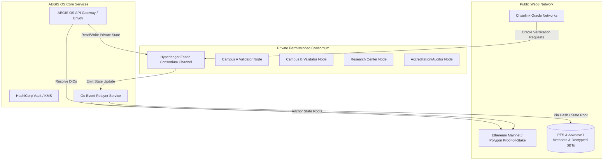
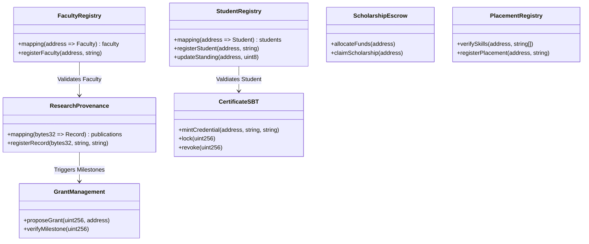
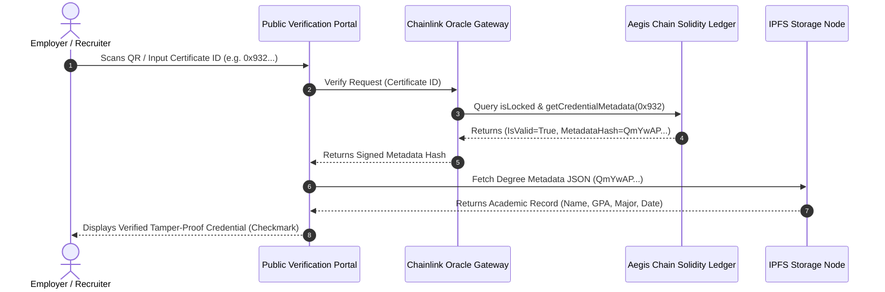

# AEGIS CHAIN — Academic Trust, Identity, & Governance Infrastructure

This document outlines the detailed system design, cryptographic frameworks, smart contract specifications, and deployment topologies for **AEGIS CHAIN**, the trust and credential layer of the AEGIS University Operating System.

---

## 1. Hybrid Blockchain Architecture

AEGIS CHAIN uses a **hybrid blockchain topology** to balance public transparency, auditability, and tamper-proofing with private compliance (FERPA, GDPR, HIPAA) for sensitive academic data.



### Compute & Node Splitting:
*   **Private Consortium Channel (Hyperledger Fabric)**: Hosts detailed student transcripts, grade logs, research collaborations, and internal financial transactions. Controlled by university nodes (registrars, IT depts).
*   **Public Verification Anchoring (Polygon PoS / Arbitrum Orbit)**: Anchors state roots of private databases and hosts Soulbound Tokens (SBT) representing final degree completions.
*   **Consortium Nodes**:
    *   *Multi-Campus Validator Nodes*: Run by campus registrars to validate database changes.
    *   *Research Nodes*: Run by academic laboratories and libraries to log provenance events.
    *   *Verification Nodes*: Read-only node mirrors held by partner government agencies and corporate recruiters.

---

## 2. Smart Contract Design & Interfaces

We present the structural definitions and Solidity interfaces for the 7 core contracts of AEGIS CHAIN.



### 1. Student Smart Contract (`StudentRegistry.sol`)
Manages student registration status, academic status, and enrollment audits.
```solidity
// SPDX-License-Identifier: MIT
pragma solidity ^0.8.20;

interface IStudentRegistry {
    struct Student {
        string studentId;
        string name;
        uint256 enrollmentDate;
        uint8 academicStatus; // 1 = Active, 2 = Suspended, 3 = Graduated
        bool exists;
    }

    event StudentRegistered(address indexed wallet, string studentId, string name);
    event StatusChanged(address indexed wallet, uint8 newStatus);

    function registerStudent(address wallet, string calldata studentId, string calldata name) external;
    function setAcademicStatus(address wallet, uint8 status) external;
    function getStudent(address wallet) external view returns (Student memory);
}
```

### 2. Faculty Smart Contract (`FacultyRegistry.sol`)
Tracks faculty accreditations, departments, and cryptographic signature authorizations.
```solidity
interface IFacultyRegistry {
    struct Faculty {
        string employeeId;
        string name;
        string department;
        bool isAuthorizedToGrade;
        bool exists;
    }

    event FacultyRegistered(address indexed wallet, string employeeId, string name);

    function registerFaculty(address wallet, string calldata employeeId, string calldata name, string calldata department) external;
    function setGradingAuthorization(address wallet, bool isAuthorized) external;
    function isFaculty(address wallet) external view returns (bool);
}
```

### 3. Research Provenance Smart Contract (`ResearchProvenance.sol`)
Logs academic research papers and patent fingerprint hashes.
```solidity
interface IResearchProvenance {
    struct ResearchRecord {
        bytes32 paperHash; // Hash of the paper PDF/data
        string title;
        address leadAuthor;
        address[] collaborators;
        string ipfsMetadataUrl;
        uint256 creationTime;
    }

    event RecordRegistered(bytes32 indexed paperHash, string title, address indexed leadAuthor);

    function registerResearch(
        bytes32 paperHash,
        string calldata title,
        address[] calldata collaborators,
        string calldata ipfsMetadataUrl
    ) external;
    
    function getResearch(bytes32 paperHash) external view returns (ResearchRecord memory);
}
```

### 4. Certificate Smart Contract (`CertificateSBT.sol`)
Implements Soulbound Tokens (SBT) representing non-transferable degree accomplishments.
```solidity
interface ICertificateSBT {
    event Issued(uint256 indexed tokenId, address indexed student, string credentialHash);
    event Revoked(uint256 indexed tokenId, string reason);
    event Locked(uint256 indexed tokenId);

    function mintCredential(
        address student,
        string calldata credentialHash,
        string calldata ipfsMetadataUrl
    ) external returns (uint256);

    function revokeCredential(uint256 tokenId, string calldata reason) external;
    function isLocked(uint256 tokenId) external view returns (bool);
    function getCredentialMetadata(uint256 tokenId) external view returns (string memory, string memory);
}
```

### 5. Scholarship Smart Contract (`ScholarshipEscrow.sol`)
Secures scholarship funds and executes automatic, rule-based semester payouts.
```solidity
interface IScholarshipEscrow {
    struct Scholarship {
        uint256 totalFund;
        uint256 disbursed;
        uint256 claimLimitPerSemester;
        uint8 totalSemesters;
        uint8 semestersClaimed;
        bool active;
    }

    event ScholarshipAllocated(address indexed student, uint256 totalAmount);
    event FundsDisbursed(address indexed student, uint256 amount);

    function allocateScholarship(address student, uint256 limitPerSemester, uint8 totalSemesters) external payable;
    function releaseSemesterPayout(address student) external;
}
```

### 6. Placement Smart Contract (`PlacementRegistry.sol`)
Allows students to bind verified placement accomplishments, verified by university partners.
```solidity
interface IPlacementRegistry {
    struct Placement {
        string companyName;
        string position;
        uint256 startDate;
        bool isVerified;
    }

    event PlacementRegistered(address indexed student, string companyName, string position);
    event PlacementVerified(address indexed student, uint256 placementId);

    function registerPlacement(string calldata company, string calldata position) external returns (uint256);
    function verifyPlacement(address student, uint256 placementId) external;
}
```

### 7. Grant Management Smart Contract (`GrantManagement.sol`)
Escrows research grants and releases funds based on peer reviews.
```solidity
interface IGrantManagement {
    struct ResearchGrant {
        uint256 totalEscrow;
        uint256 disbursed;
        uint8 totalMilestones;
        uint8 verifiedMilestones;
        address payable leadResearcher;
        bool funded;
    }

    event GrantAllocated(uint256 indexed grantId, address indexed researcher, uint256 amount);
    event MilestoneReleased(uint256 indexed grantId, uint8 milestoneIndex, uint256 amount);

    function createGrant(uint256 grantId, address payable researcher, uint8 milestones) external payable;
    function approveMilestone(uint256 grantId) external;
}
```

---

## 3. Decentralized Identity (DID) Architecture

AEGIS CHAIN implements **W3C compliant Decentralized Identifiers (DIDs)** using the custom `did:aegis:` method namespace.

### Decentralized DID Document Schema (JSON):
```json
{
  "@context": [
    "https://www.w3.org/ns/did/v1",
    "https://w3id.org/security/suites/ed25519-2020/v1"
  ],
  "id": "did:aegis:sol:0x1b790d984d720a45594efa4cbefe46df7db0e21",
  "verificationMethod": [
    {
      "id": "did:aegis:sol:0x1b790d984d720a45594efa4cbefe46df7db0e21#key-1",
      "type": "Ed25519VerificationKey2020",
      "controller": "did:aegis:sol:0x1b790d984d720a45594efa4cbefe46df7db0e21",
      "publicKeyMultibase": "z6MkmRY9d84dHnKpeP1GvD22xJ8Pq5n9"
    }
  ],
  "authentication": [
    "did:aegis:sol:0x1b790d984d720a45594efa4cbefe46df7db0e21#key-1"
  ],
  "assertionMethod": [
    "did:aegis:sol:0x1b790d984d720a45594efa4cbefe46df7db0e21#key-1"
  ],
  "service": [
    {
      "id": "did:aegis:sol:0x1b790d984d720a45594efa4cbefe46df7db0e21#credential-service",
      "type": "CredentialRegistry",
      "serviceEndpoint": "https://identity.aegis.edu/api/v1/resolve"
    }
  ]
}
```

### Cryptographic Signatures & Zero-Trust Authentication:
1.  **Key Pair Derivation**: Users generate keys within their identity wallet. The private key never leaves the device's hardware enclave or keychain.
2.  **DID Resolution**: Resolvers resolve `did:aegis:` DIDs by retrieving the verification methods from the smart contract registry.
3.  **Challenge-Response Auth**: To log in, the AEGIS gateway issues a random challenge payload. The student's device signs it with their private key, proving authentication without transmitting passwords.

---

## 4. Credential Verification Flow

The process of academic verification spans public nodes, cryptographic hash checking, and document validation.



1.  **QR Verification**: Certificates feature signed QR codes that embed the verification link: `https://verify.aegis.edu/cert/0x12c9a...`.
2.  **Public Portal**: The public portal queries the `CertificateSBT.sol` contract directly on-chain to check if the certificate token exists and has not been revoked.
3.  **Audit Logs**: Each lookup registers an event footprint to track analytical verification metrics.

---

## 5. NFT Credential System (Soulbound Tokens)

AEGIS CHAIN implements **ERC-5192 (Minimal Soulbound Tokens)**, extending the standard ERC-721 interface. Soulbound tokens are non-transferable and remain locked to the recipient's identity contract address.

### ERC-5192 Interface Implementation:
```solidity
// SPDX-License-Identifier: MIT
pragma solidity ^0.8.20;

import "@openzeppelin/contracts/token/ERC721/ERC721.sol";
import "./IERC5192.sol"; // Soulbound interface

contract AegisDegreeSBT is ERC721, IERC5192 {
    
    address public registrar;
    mapping(uint256 => bool) private _locked;

    modifier onlyRegistrar() {
        require(msg.sender == registrar, "SBT: Only registrar can call this");
        _;
    }

    constructor(string memory name, string memory symbol) ERC721(name, symbol) {
        registrar = msg.sender;
    }

    function mint(address to, uint256 tokenId) external onlyRegistrar {
        _safeMint(to, tokenId);
        _locked[tokenId] = true;
        emit Locked(tokenId);
    }

    function locked(uint256 tokenId) external view override returns (bool) {
        require(_ownerOf(tokenId) != address(0), "SBT: Token does not exist");
        return _locked[tokenId];
    }

    // Override transfer functions to enforce Soulbound constraints
    function transferFrom(address from, address to, uint256 tokenId) public override {
        revert("SBT: Degree certificates are non-transferable");
    }

    function safeTransferFrom(address from, address to, uint256 tokenId, bytes memory data) public override {
        revert("SBT: Degree certificates are non-transferable");
    }
}
```

### Metadata Payload Specification (IPFS JSON Schema):
```json
{
  "title": "Degree of Bachelor of Science in Computer Science",
  "type": "object",
  "properties": {
    "recipient": {
      "type": "string",
      "description": "Student Name (e.g. Alice Smith)"
    },
    "studentDid": {
      "type": "string",
      "description": "did:aegis:sol:0x1b790d984d720a45594efa4cbefe46df7db0e21"
    },
    "institution": {
      "type": "string",
      "default": "AEGIS UNIVERSITY"
    },
    "degree": {
      "type": "string",
      "default": "Bachelor of Science"
    },
    "major": {
      "type": "string",
      "default": "Computer Science & Artificial Intelligence"
    },
    "gradeClass": {
      "type": "string",
      "default": "First Class with Distinction"
    },
    "issueDate": {
      "type": "string",
      "format": "date-time"
    },
    "signature": {
      "type": "string",
      "description": "Registrar cryptographic proof signature"
    }
  }
}
```

---

## 6. Academic Wallet Design

The **Student Academic Wallet** acts as a user-owned interface that displays achievements, verification keys, and academic credentials.

```
┌────────────────────────────────────────────────────────┐
│  Academic Wallet  🔑 did:aegis:sol:0x1b79...          │
├────────────────────────────────────────────────────────┤
│  Balances:  Gas Credit [ 0.05 MATIC ]                  │
├────────────────────────────────────────────────────────┤
│  Credentials (SBTs):                                   │
│  🎓 B.Sc Computer Science    [ Verified Certificate ]   │
│  🏅 Quantum Computing Badge  [ Verified Achievement ]   │
├────────────────────────────────────────────────────────┤
│  Documents:                                            │
│  📄 Academic Transcript.pdf  [ Hash: Qm78a1... ]       │
│  🧪 Research Paper Draft     [ Hash: Qm12b5... ]       │
├────────────────────────────────────────────────────────┤
│  Sign Payload Utility:                                 │
│  [ Input: "Recruiter Challenge String"             ]   │
│  👉 [ Sign & Respond ]                                 │
└────────────────────────────────────────────────────────┘
```

### Key Management & HD Wallets:
*   **BIP-39**: Generates a 12 or 24-word seed phrase to secure student keys.
*   **BIP-44 Derivation Path**: `m/44'/60'/0'/0/0` (standard Ethereum derivation for identity and transaction signing).
*   **Encrypted Storage**: The private key is encrypted using AES-256 and stored on-device inside the Secure Enclave or local Keychain, unlockable only via Biometrics (FaceID/TouchID).

---

## 7. Research Provenance System

Research files, patents, citations, version changes, and collaboration histories are logged to maintain an immutable provenance trail.

```
       Research Draft (v1) -> Hash locked on-chain (Block 245,110)
              │
              ▼
   Collaborator Addition -> Multi-sig updates metadata records
              │
              ▼
    Peer Review Approval -> Faculty signs verified citation hash
              │
              ▼
Publishing to Research Marketplace -> SBT issued; files pinned to Arweave
```

*   **Arweave Permanent Storage**: Heavy scientific raw datasets, research drafts, and patent PDF documentation are permanently pinned to Arweave for persistent historical records.
*   **On-chain References**: The `ResearchProvenance.sol` contract registers citation indexes by storing mapped lists of previous paper hashes inside the publication struct, creating an on-chain citation graph.

---

## 8. DAO Governance Design

The governance framework enables students, faculty, and departments to propose initiatives and participate in university governance.

```
[Draft Proposal] -> (Submit & Minimum Deposit) -> [Active Proposal Registry]
                                                       │
                                                       ▼
[Execute / Passed] <── (Count Weights / Role check) <── [ quadratic Voting Phase ]
```

### Quadratic Voting Model:
To prevent capital dominance, voting power scales quadratically with respect to voter role-allocated token weights. If a faculty member wishes to apply multiple voting credits ($C_i$) to a single initiative:
$$\text{Voting Power} = \sqrt{\text{Credits Allocated}}$$

### Governance Stages:
1.  **Drafting Phase**: Initial proposal creation. Requires minimum backing threshold (e.g. 5 signers).
2.  **Voting Phase**: Set to run for exactly 7 days.
3.  **Resolution Phase**: Admin/DAO Executor triggers evaluation. If approvals outnumber rejects, the proposal state changes to `Passed`.

---

## 9. Security Architecture

1.  **Multi-Signature Administration**: Master changes, treasury allocations, and registrar/faculty authorization updates are managed by a **3-of-5 Gnosis Safe Multi-Sig** wallet controlled by the Board of Trustees and Administrative deans.
2.  **Hardware Security Modules (HSM)**: University nodes use institutional HSM systems to secure keys and automate state-root anchoring.
3.  **Social Recovery Mechanism**: If a student loses access to their wallet private keys, they can initiate a recovery flow through the Registrar's portal. A transaction signed by 2 authorized Registrar keys resets the student's registered DID address.

---

## 10. Production Deployment Plan

```
 Phase 1: Testnet Setup         Phase 2: Grants Escrow        Phase 3: Public Registry
 ┌──────────────────────┐       ┌──────────────────────┐      ┌──────────────────────┐
 │ • Deploy Private node│       │ • Grant Escrow tests │      │ • Launch SBT Portal  │
 │ • Mint Test Identity │ ───►  │ • Escrow Funding run │ ───► │ • Employer Portal    │
 │ • Audit DID Contract │       │ • Bridge Deployment  │      │ • Open Mainnet live  │
 └──────────────────────┘       └──────────────────────┘      └──────────────────────┘
     Month 1 - 2                    Month 3 - 4                   Month 5 - 6
```

### Rollout Timeline & Phases:
*   **Month 1-2 (Phase 1)**: Private consortium dev nodes launch. Student enrollment testing and DID registries integration.
*   **Month 3-4 (Phase 2)**: Integration of tuition payment escrows and research grant milestones on a staging network. Auditing of smart contracts.
*   **Month 5-6 (Phase 3)**: Official mainnet release. Production deployment of public SBTs and release of the employer verification portal.
