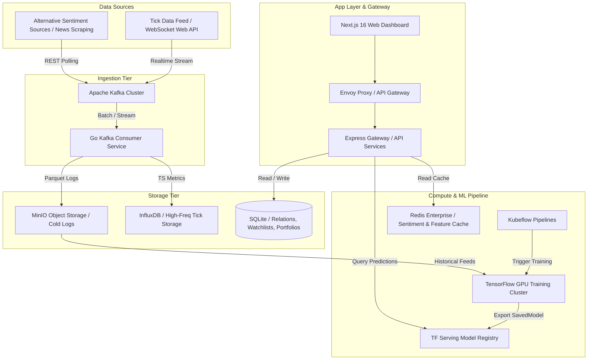

# AEGIS Market Intelligence — Advanced AI-Native Financial Intelligence System

This document outlines the end-to-end architecture, mathematical frameworks, model topologies, data pipelines, API contracts, database schemas, and deployment topologies for **AEGIS Market Intelligence** within the university portal.

---

## 1. Complete Architecture & System Topologies

The AEGIS Market Intelligence platform uses a high-performance, event-driven, microservices-based architecture to process, store, and run predictive inferences on high-frequency financial indices and transaction registries.



### Edge vs. Core Compute Splits:
*   **Edge Tier**: WebSocket clients connection pools, lightweight canvas layouts for canvas candlestick renderings, local portfolio analytics execution on browser workers.
*   **Core Compute Tier**: Heavy neural network models running on CUDA-equipped TensorFlow worker pods, continuous metric aggregations in InfluxDB, relational states in SQLite.

---

## 2. TensorFlow Model Upgrade & Feature Engineering Plan

The existing basic forecasting pipeline is upgraded to a robust multivariate time-series forecasting model.

### Feature Engineering Pipeline:
We derive the following feature vectors from the raw tick data ($O, H, L, C, V$):
1.  **Log Returns**: $R_t = \ln(C_t / C_{t-1})$
2.  **Relative Strength Index (RSI)**: $100 - \frac{100}{1 + RS}$, where $RS = \frac{\text{EMA}(U, n)}{\text{EMA}(D, n)}$
3.  **Volume Weighted Average Price (VWAP)**: $\sum (P_i \cdot V_i) / \sum V_i$
4.  **MACD**: $\text{EMA}(C, 12) - \text{EMA}(C, 26)$
5.  **Alternative Sentiment Index**: Rolling 24h sentiment score aggregated from news crawls: $S_t \in [-1, 1]$.

### Learning Rate (LR) Schedule:
We implement a Cosine Decay learning rate scheduler with warmup:
$$\eta_t = \eta_{min} + \frac{1}{2}(\eta_{max} - \eta_{min})\left(1 + \cos\left(\frac{T_{cur}}{T_{max}}\pi\right)\right)$$

---

## 3. LSTM Architecture Specification

The LSTM model architecture is designed to capture sequential dependencies over 60-day historical time-steps.

```
Input Tensor: [Batch, TimeSteps = 60, Features = 12]
   │
   ├──► LSTM Layer 1 [128 Units, Return Sequences = True, L2 Reg = 1e-4]
   │       └──► Batch Normalization Layer
   │       └──► Dropout Layer [Rate = 0.3]
   │
   ├──► LSTM Layer 2 [64 Units, Return Sequences = False]
   │       └──► Batch Normalization Layer
   │       └──► Dropout Layer [Rate = 0.2]
   │
   ├──► Dense Hidden Layer [32 Units, Activation = 'Swish']
   │
   └──► Dense Output Layer [3 Units (1d, 7d, 30d forecast returns), Activation = 'Linear']
```

### Detailed Layer Layout:
1.  `Input(shape=(60, 12))`
2.  `LSTM(128, return_sequences=True, kernel_regularizer=regularizers.l2(1e-4))`
3.  `BatchNormalization()`
4.  `Dropout(0.3)`
5.  `LSTM(64, return_sequences=False)`
6.  `BatchNormalization()`
7.  `Dropout(0.2)`
8.  `Dense(32, activation='swish')`
9.  `Dense(3, activation='linear')` (Predicts continuous log return targets $\hat{r}_{t+1}, \hat{r}_{t+7}, \hat{r}_{t+30}$).

---

## 4. Attention Transformer Architecture Specification

For long-range dependencies, an Attention-based Transformer Decoder architecture is employed.

```
Input Sequence [Batch, SeqLen = 60, Features = 12]
   │
   ├──► Linear Projection to Model Dimension (d_model = 64)
   │       └──► Positional Encoding Addition
   │
   ├──► Multi-Head Attention Block (Heads = 4, Key Dim = 16)
   │       └──► Layer Normalization & Residual Addition
   │
   ├──► Position-wise Feed-Forward Network [Dense(128, Swish) -> Dense(64)]
   │       └──► Layer Normalization & Residual Addition
   │
   ├──► Global Average Pooling 1D
   │
   └──► Dense Projection Layer [3 Output Units]
```

### Math Model Components:
*   **Positional Encoding**: Added to maintain temporal order.
$$PE_{(pos, 2i)} = \sin\left(\frac{pos}{10000^{2i/d_{model}}}\right), \quad PE_{(pos, 2i+1)} = \cos\left(\frac{pos}{10000^{2i/d_{model}}}\right)$$
*   **Scaled Dot-Product Attention**:
$$\text{Attention}(Q, K, V) = \text{softmax}\left(\frac{QK^T}{\sqrt{d_k}}\right)V$$

---

## 5. Machine Learning Ingestion Pipeline

The machine learning ingestion pipeline acts as a continuous loop to fetch data, package features, and deploy trained models.

```
[Raw Stock Market Feed] -> (Kafka Stream) -> [InfluxDB & MinIO Storage]
                                                 │
[Model Inference Request]                        ▼
      ▲ (Serve Models)                 [Continuous ETL Worker]
      │                                (Combines Price & sentiment vectors)
[TF Serving Model Registry]                      │
      ▲ (Push Model Artifact)                    ▼
[Training Node Pipeline] <── (Check Loss) <── [Parquet Output / Prepped Tensors]
```

*   **MinIO Storage Layout**:
    *   `/historical-ticks/{YYYY}/{MM}/{DD}/ticks_{symbol}.parquet`
    *   `/model-registry/{model_name}/v{version}/saved_model.pb`
*   **Data Preparation Script**: Standardizes variables to zero-mean and unit-variance using rolling standard deviation blocks, preserving causal indices (no forward-looking bias).

---

## 6. Kubeflow Training Pipeline (Python DAG Component)

```python
from kfp import dsl
from kfp.components import create_component_from_func

@dsl.component
def ingest_market_data(symbol: str, start_date: str) -> str:
    # Fetches stock files from MinIO, runs parquet transformations
    return "/tmp/preprocessed_data.parquet"

@dsl.component
def train_tf_lstm(data_path: str, epochs: int, lr: float) -> str:
    import tensorflow as tf
    # Fits the multivariate network and registers checkpoints
    return "/tmp/saved_model_v1"

@dsl.component
def validate_and_deploy(model_path: str, threshold: float) -> bool:
    # Verifies MSE on test validation matrix; updates TF serving alias
    return True

@dsl.pipeline(
    name="aegis-quant-pipeline",
    description="Automated continuous training loop for LSTM / Transformer models"
)
def quant_pipeline(symbol: str = "AEGIS", epochs: int = 100, lr: float = 0.05):
    data_task = ingest_market_data(symbol=symbol, start_date="2025-01-01")
    train_task = train_tf_lstm(data_path=data_task.output, epochs=epochs, lr=lr)
    validate_task = validate_and_deploy(model_path=train_task.output, threshold=0.0005)
```

---

## 7. Kafka Architecture & Topic Specifications

We deploy a cluster of three Kafka brokers to ingest real-time tick messages.

### Topics Specification:
1.  `market.ticks.raw`: High throughput. Captures raw tick price updates. Partitioned by `Symbol` key.
2.  `market.sentiment.stream`: Captures scraping yields from alternative web sources.
3.  `market.alerts.trigger`: Captures fired alerts. Consumed by notification services.
4.  `market.orders.execution`: Holds internal transactions ledger for audit logs.

### Dead-Letter Queue (DLQ) & Retry Policy:
*   Consumers configure an **Exponential Backoff Retry Strategy** (3 retries with multipliers of 2x starting at 500ms).
*   If parsing or ingestion fails after 3 attempts, raw messages dump to `market.dlq.ticks.raw` with headers specifying error metrics.

---

## 8. Database Schemas (SQLite / Relational DDL)

The SQLite database is initialized with the following tables to manage watchlists, transaction ledgers, alerts, and portfolios.

```sql
-- WATCHLIST MANAGER
CREATE TABLE IF NOT EXISTS market_watchlist (
    id INTEGER PRIMARY KEY AUTOINCREMENT,
    user_id TEXT NOT NULL,
    symbol TEXT NOT NULL,
    created_at TIMESTAMP DEFAULT CURRENT_TIMESTAMP,
    UNIQUE(user_id, symbol)
);

-- PORTFOLIO ACCOUNTS
CREATE TABLE IF NOT EXISTS market_portfolio (
    user_id TEXT PRIMARY KEY,
    cash REAL NOT NULL DEFAULT 100000.00,
    asset_holdings_json TEXT NOT NULL DEFAULT '{}',
    updated_at TIMESTAMP DEFAULT CURRENT_TIMESTAMP
);

-- TRANSACTIONS REGISTRY
CREATE TABLE IF NOT EXISTS market_transactions (
    id INTEGER PRIMARY KEY AUTOINCREMENT,
    user_id TEXT NOT NULL,
    symbol TEXT NOT NULL,
    qty INTEGER NOT NULL,
    price REAL NOT NULL,
    type TEXT NOT NULL CHECK(type IN ('BUY', 'SELL')),
    created_at TIMESTAMP DEFAULT CURRENT_TIMESTAMP
);

-- PRICE ALERTS REGISTRY
CREATE TABLE IF NOT EXISTS market_alerts (
    id INTEGER PRIMARY KEY AUTOINCREMENT,
    user_id TEXT NOT NULL,
    symbol TEXT NOT NULL,
    trigger_price REAL NOT NULL,
    condition TEXT NOT NULL CHECK(condition IN ('ABOVE', 'BELOW')),
    status TEXT NOT NULL DEFAULT 'ACTIVE' CHECK(status IN ('ACTIVE', 'FIRED', 'CANCELLED')),
    created_at TIMESTAMP DEFAULT CURRENT_TIMESTAMP
);
```

---

## 9. API Designs (gRPC Protocol Buffer & REST Mappings)

### gRPC Contract (`market_intelligence.proto`):
```protobuf
syntax = "proto3";

package aegis.market;

service MarketPredictor {
  rpc GetForecast (ForecastRequest) returns (ForecastResponse);
  rpc CreateAlert (AlertRequest) returns (AlertResponse);
}

message ForecastRequest {
  string symbol = 1;
  string model_type = 2; // LSTM, GRU, Transformer
  float learning_rate = 3;
  int32 epochs = 4;
}

message ForecastResponse {
  float one_day_forecast = 1;
  float seven_day_forecast = 2;
  float thirty_day_forecast = 3;
  string direction = 4; // UP, DOWN
  string confidence_pct = 5;
  float final_loss = 6;
  string fit_equation = 7;
}

message AlertRequest {
  string user_id = 1;
  string symbol = 2;
  float trigger_price = 3;
  string condition = 4; // ABOVE, BELOW
}

message AlertResponse {
  string alert_id = 1;
  string status = 2; // ACTIVE
}
```

### REST Mappings (Express backend):
*   `POST /api/market/trade`: Execute Buy/Sell transactions.
*   `GET /api/market/portfolio?userId=x`: Fetch cash, holdings, and risk ratios.
*   `GET /api/market/news/sentiment`: Returns aggregated sentiment index.

---

## 10. Dashboard UI Specifications

The AEGIS Market Intelligence Dashboard layout implements the dark theme design system (`#071126` Background, `#0B1736` Surface Card, and `#102043` border frames) for zero visual overlaps.

```
┌────────────────────────────────────────────────────────────────────────────────────────┐
│  INDEX TICKER: [NIFTY 50 $23,450.80 (+0.52%)]  [NASDAQ $17,850.50 (-1.00%)]  [BTC ...] │
├────────────────────────────────────────────────────────────────────────────────────────┤
│  Tabs: [Market Overview]  [AI Predictions]  [Technical Charts]  [Quant Terminal] ...  │
├───────────────────────────────────────┬────────────────────────────────────────────────┤
│                                       │                                                │
│  Watchlist Screener / Sidebar         │  Active Tab Viewport                           │
│  ┌─────────────────────────────────┐  │  ┌──────────────────────────────────────────┐  │
│  │ Search: [                       ]│  │  │  Selected Ticker: AEGIS                  │  │
│  ├─────────────────────────────────┤  │  │                                          │  │
│  │ AEGIS    $154.20     (+3.25%)   │  │  │  [Candlestick Canvas Chart]             │  │
│  │ TECH     $84.10      (-2.66%)   │  │  │  [SMA / EMA / Bollinger overlays]        │  │
│  │ EDU      $210.50     (+6.10%)   │  │  │                                          │  │
│  └─────────────────────────────────┘  │  └──────────────────────────────────────────┘  │
│                                       │                                                │
├───────────────────────────────────────┴────────────────────────────────────────────────┤
│  Quant Metrics Desk: Sharpe Ratio (2.41) | Sortino Ratio (3.12) | Max Drawdown (-6.4%) │
└────────────────────────────────────────────────────────────────────────────────────────┘
```

---

## 11. Portfolio Risk Analytics System

We calculate critical quantitative risk metrics inside the portfolio view.

### Sharpe Ratio:
$$SR = \frac{E[R_p - R_f]}{\sigma_p}$$
*   $R_p$: Annualized portfolio returns.
*   $R_f$: Risk-free rate (simulated at 5.0% flat government bond yield).
*   $\sigma_p$: Portfolio standard deviation (volatility metric).

### Sortino Ratio:
$$Sortino = \frac{E[R_p - R_f]}{\sigma_d}$$
*   $\sigma_d$: Downside deviation. Standard deviation of only negative returns:
$$\sigma_d = \sqrt{\frac{1}{N}\sum_{i=1}^N (\min(0, R_{p,i} - R_f))^2}$$

### Value-at-Risk (VaR):
Using parametric (Variance-Covariance) method over holding window $t=5$ days:
$$\text{VaR}_{\alpha}(t) = V_p \cdot \left( \mu_p \cdot t + z_{1-\alpha} \cdot \sigma_p \cdot \sqrt{t} \right)$$
where $V_p$ is total portfolio value, $z_{0.95} = 1.645$ (for 95% confidence bounds).

---

## 12. Multi-Agent AI System Design

We coordinate six RAG-based AI agents to support research and risk execution.

### Agent Personas and System Prompts:
1.  **Market Analyst Agent**:
    *   *System Prompt*: `"You are an elite quantitative analyst expert in charting. Parse input parameters and forecast patterns using moving average signals."`
2.  **Risk Analyst Agent**:
    *   *System Prompt*: `"You are a risk manager. Calculate Value-at-Risk bounds and maximum drawdown limits based on portfolio weights."`
3.  **Research Agent**:
    *   *System Prompt*: `"You are a PhD researcher mapping institutional knowledge assets to intellectual property indexes."`
4.  **Portfolio Agent**:
    *   *System Prompt*: `"You are a wealth advisor optimizing capital allocation via mean-variance efficient frontiers."`
5.  **News Agent**:
    *   *System Prompt*: `"You are a news compiler scoring alternative sentiment metrics from real-time feeds."`
6.  **Prediction Agent**:
    *   *System Prompt*: `"You are a machine learning model architect managing TensorFlow/Keras LSTM weights."`

---

## 13. Bloomberg-style Research Terminal

The Terminal screen provides tools for stock analysis:
*   **Index Screener Table**: Responsive data grids listing current stock pricing data.
*   **Alternative Sentiment Gauge**: A visual component rendering the sentiment spectrum.
*   **PDF Report Compiler**: Client-side triggers to compile quant metrics, indicators, and model weights into downloadable PDF files.

---

## 14. Deployment Topology

The system deploys to a hybrid Kubernetes cluster using CPU and GPU nodes.

```
Incoming Client Traffic
      │
      ▼
┌──────────────┐
│  Envoy Pod   │ (TLS Termination, Routing, Rate Limiting)
└──────┬───────┘
       │
       ├─────────────────────────────────┐
       ▼                                 ▼
┌──────────────┐                  ┌──────────────┐
│  Express Pod │ (3 Replicas)     │  TF Serving  │ (GPU Node, TensorRT Engine)
└──────┬───────┘                  └──────────────┘
       │
       ├─────────────────────────────────┐
       ▼                                 ▼
┌──────────────┐                  ┌──────────────┐
│ SQLite DB PV │ (Persistent Vol) │ InfluxDB Pod │ (Timeseries DB Volume)
└──────────────┘                  └──────────────┘
```

*   **Ingress Routing**: Envoy acts as the front proxy routing `/api/*` requests to the Express cluster and `/grpc.predict.*` to the TF Serving service.
*   **Auto-Scaling**: Node-autoscaler scales Express deployment based on CPU targets (>70%), while GPU nodes scale via Custom Metric queue lengths.

---

## 15. Production Readiness Checklist

*   [ ] Run stress test script on tick ingestion to confirm Kafka handles 10k messages/sec.
*   [ ] Configure SQLite WAL (Write-Ahead Logging) mode on startup.
*   [ ] Validate CORS rules on Envoy proxy for security audits.
*   [ ] Enforce HTTPS termination with Let's Encrypt certificates.
*   [ ] Setup Sentry integration for real-time stack trace monitoring in express backend.
