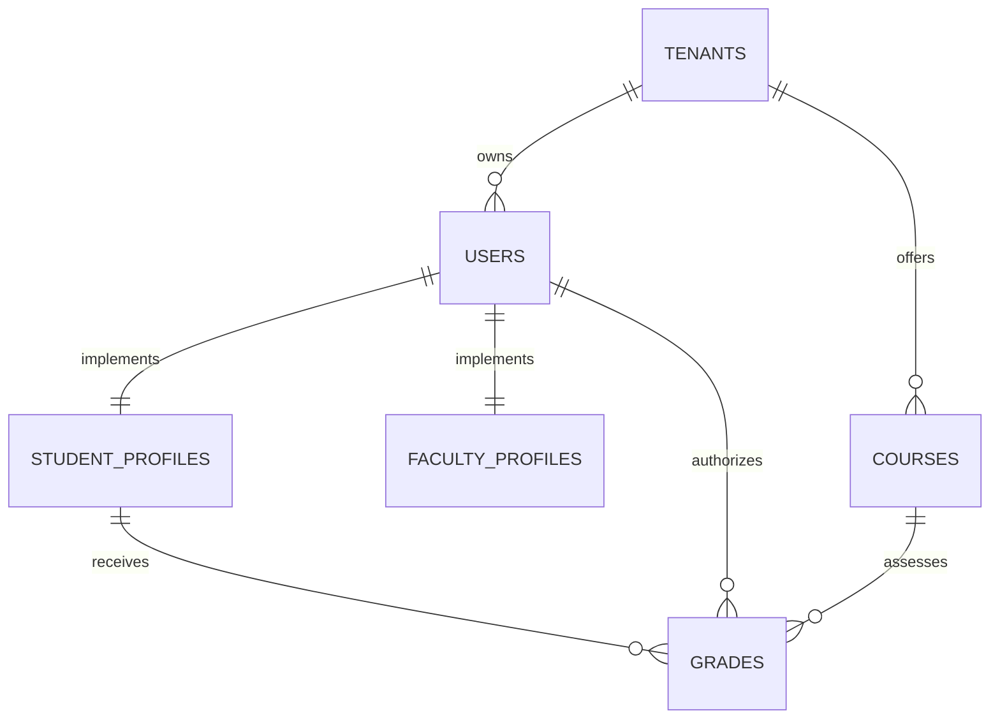
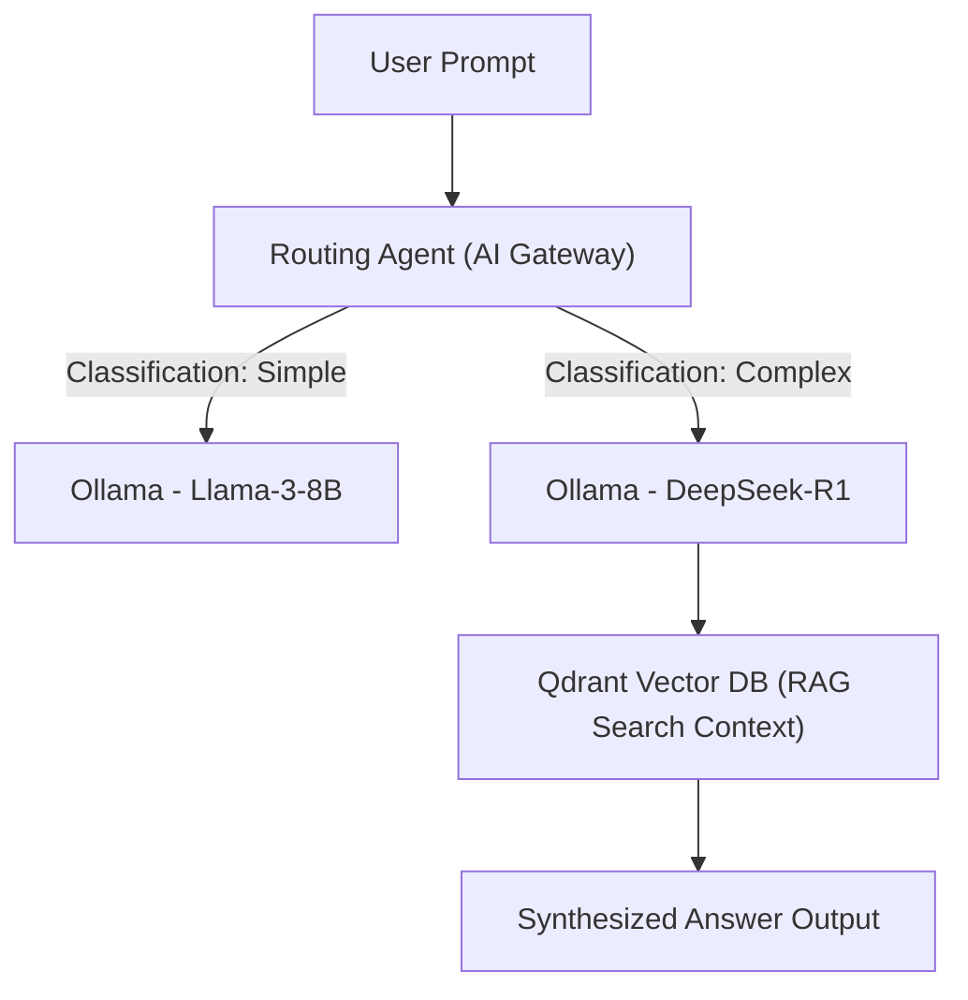
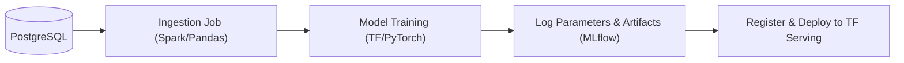
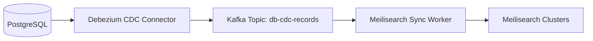
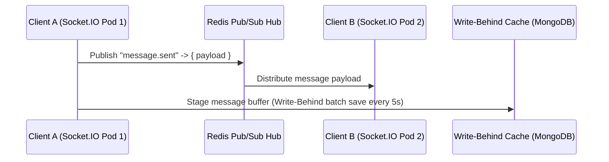
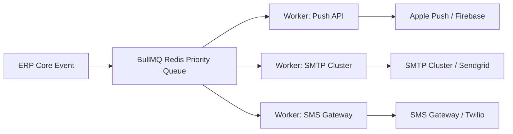

# AEGIS OS: Global AI-Native University Operating System Master Blueprint (2026 Edition)
**Document Version:** 2026.1.0-GA  
**Classification:** Enterprise System Architecture Specification  
**Scale Capacity:** 1,000,000+ Concurrent Students, Multi-Tenant SaaS, Global Active-Active

---

## 1. Product Vision

Aegis OS is a unified AI-Native University Operating System. It replaces fragmented administrative (ERP), learning (LMS), collaboration (Chat/Video), and recruitment (Applicant Tracking) portfolios with a single event-driven, tenant-isolated cloud-native operating plane.

### Target Replacements
* **LMS/ERP**: Moodle, Blackboard, Canvas, Banner.
* **Collaboration**: Slack, Microsoft Teams, WhatsApp Groups.
* **Knowledge**: Traditional files systems, search indices, and disconnected Excel ledgers.

---

## 2. Complete Architecture

The platform operates on a shared-nothing, multi-region active-active edge deployment. Global traffic is dynamically routed to the nearest regional cluster based on latency.

```mermaid
graph TD
    Client["Client Devices (Web/Mobile)"] --> DNS["Route 53 Global Geo-DNS"]
    DNS --> Edge["Cloudflare CDN & WAF (Edge SSL/Cache)"]
    Edge --> Gateway["Envoy API Gateway (Kubernetes Ingress)"]
    Gateway --> Mesh["Istio Service Mesh (mTLS & Canary)"]
    
    subgraph Compute ["Orchestrated Workloads (EKS/GKE)"]
        Mesh --> Microservices["NestJS / Go / Python Microservices"]
        Microservices --> RedisCluster[("Redis Cluster (Session, Cache, Limits)")]
    end
    
    subgraph Storage ["Distributed Persistent Tier"]
        Microservices --> PostgreSQL Aurora[("PostgreSQL Aurora Grid (RLS Isolated)")]
        Microservices --> KafkaEvent["Apache Kafka Event Bus"]
        Microservices --> QdrantDB[("Qdrant Vector DB (RAG Indexes)")]
        Microservices --> MeilisearchCluster[("Meilisearch Cluster")]
        Microservices --> MinIOObject[("MinIO Object Storage")]
    end
```

---

## 3. Microservices Design

Aegis OS decomposes university operations into decoupled hexagonal microservices. Services communicate via high-performance **gRPC** for synchronous operations and broadcast state updates via **Apache Kafka**.

```text
+----------------------+----------------------+----------------------+
|  Identity Service    |   Academic Registry  |   Attendance Engine  |
|  Prisma / Postgres   |  Prisma / Postgres   |     Go / Redis       |
+----------------------+----------------------+----------------------+
|  Grading & Exams     |  Collaboration Chat  |    AI System Broker  |
|  NestJS / Postgres   |  Node.js / MongoDB   |   Python / Qdrant    |
+----------------------+----------------------+----------------------+
|  Finance & Ledger    |  Library Registry    |  Placement Engine    |
|  NestJS / Postgres   |  NestJS / Postgres   |  NestJS / Postgres   |
+----------------------+----------------------+----------------------+
```

---

## 4. Database Schema (PostgreSQL DDL)

Tenant isolation is enforced in PostgreSQL using Row-Level Security (RLS) policies.

```sql
CREATE EXTENSION IF NOT EXISTS "uuid-ossp";

-- Tenants Table
CREATE TABLE tenants (
    id UUID PRIMARY KEY DEFAULT uuid_generate_v4(),
    domain VARCHAR(255) UNIQUE NOT NULL,
    name VARCHAR(255) NOT NULL,
    tier VARCHAR(50) NOT NULL DEFAULT 'standard', -- 'standard', 'enterprise', 'sovereign'
    status VARCHAR(50) NOT NULL DEFAULT 'active',
    config JSONB DEFAULT '{}'::jsonb,
    created_at TIMESTAMP WITH TIME ZONE DEFAULT CURRENT_TIMESTAMP
);

-- Users (MFA & SSO Integrated)
CREATE TABLE users (
    id UUID PRIMARY KEY DEFAULT uuid_generate_v4(),
    tenant_id UUID NOT NULL REFERENCES tenants(id) ON DELETE CASCADE,
    name VARCHAR(255) NOT NULL,
    email VARCHAR(255) NOT NULL,
    password_hash VARCHAR(255) NOT NULL,
    role VARCHAR(50) NOT NULL, -- 'student', 'faculty', 'hod', 'admin'
    status VARCHAR(50) NOT NULL DEFAULT 'active',
    avatar_url TEXT,
    created_at TIMESTAMP WITH TIME ZONE DEFAULT CURRENT_TIMESTAMP,
    UNIQUE(tenant_id, email)
);
ALTER TABLE users ENABLE ROW LEVEL SECURITY;
CREATE POLICY tenant_isolation_policy ON users 
    USING (tenant_id = current_setting('app.current_tenant_id')::uuid);

-- Student Profiles
CREATE TABLE student_profiles (
    id UUID PRIMARY KEY DEFAULT uuid_generate_v4(),
    user_id UUID NOT NULL UNIQUE REFERENCES users(id) ON DELETE CASCADE,
    tenant_id UUID NOT NULL REFERENCES tenants(id) ON DELETE CASCADE,
    student_id_card VARCHAR(50) NOT NULL,
    gpa NUMERIC(3,2) DEFAULT 0.00,
    semester INT NOT NULL DEFAULT 1,
    attendance_rate NUMERIC(5,2) DEFAULT 0.00,
    academic_status VARCHAR(50) NOT NULL DEFAULT 'good_standing',
    created_at TIMESTAMP WITH TIME ZONE DEFAULT CURRENT_TIMESTAMP,
    UNIQUE(tenant_id, student_id_card)
);
ALTER TABLE student_profiles ENABLE ROW LEVEL SECURITY;
CREATE POLICY student_isolation_policy ON student_profiles
    USING (tenant_id = current_setting('app.current_tenant_id')::uuid);

-- Faculty Profiles
CREATE TABLE faculty_profiles (
    id UUID PRIMARY KEY DEFAULT uuid_generate_v4(),
    user_id UUID NOT NULL UNIQUE REFERENCES users(id) ON DELETE CASCADE,
    tenant_id UUID NOT NULL REFERENCES tenants(id) ON DELETE CASCADE,
    faculty_id_card VARCHAR(50) NOT NULL,
    designation VARCHAR(100) NOT NULL,
    department VARCHAR(100) NOT NULL,
    workload_hours INT DEFAULT 0,
    created_at TIMESTAMP WITH TIME ZONE DEFAULT CURRENT_TIMESTAMP,
    UNIQUE(tenant_id, faculty_id_card)
);
ALTER TABLE faculty_profiles ENABLE ROW LEVEL SECURITY;
CREATE POLICY faculty_isolation_policy ON faculty_profiles
    USING (tenant_id = current_setting('app.current_tenant_id')::uuid);

-- Courses Table
CREATE TABLE courses (
    code VARCHAR(50) PRIMARY KEY,
    tenant_id UUID NOT NULL REFERENCES tenants(id) ON DELETE CASCADE,
    title VARCHAR(255) NOT NULL,
    credits INT NOT NULL DEFAULT 3,
    max_enrollment INT NOT NULL DEFAULT 60,
    status VARCHAR(50) NOT NULL DEFAULT 'active'
);
ALTER TABLE courses ENABLE ROW LEVEL SECURITY;
CREATE POLICY course_isolation_policy ON courses
    USING (tenant_id = current_setting('app.current_tenant_id')::uuid);

-- Grades Table
CREATE TABLE grades (
    id UUID PRIMARY KEY DEFAULT uuid_generate_v4(),
    tenant_id UUID NOT NULL REFERENCES tenants(id) ON DELETE CASCADE,
    student_id UUID NOT NULL REFERENCES student_profiles(id) ON DELETE CASCADE,
    course_code VARCHAR(50) NOT NULL REFERENCES courses(code) ON DELETE CASCADE,
    marks NUMERIC(5,2) NOT NULL,
    grade VARCHAR(5) NOT NULL,
    semester INT NOT NULL,
    approved_by UUID REFERENCES users(id),
    ledger_tx_hash VARCHAR(66) UNIQUE,
    created_at TIMESTAMP WITH TIME ZONE DEFAULT CURRENT_TIMESTAMP
);
ALTER TABLE grades ENABLE ROW LEVEL SECURITY;
CREATE POLICY grade_isolation_policy ON grades
    USING (tenant_id = current_setting('app.current_tenant_id')::uuid);
CREATE INDEX idx_grades_student_course ON grades(tenant_id, student_id, course_code);
```

---

## 5. ER Diagram



---

## 6. API Design (gRPC Protobuf Contracts)

All synchronous high-speed communication between services relies on gRPC over HTTP/2.

```protobuf
syntax = "proto3";

package aegis.v1;

option go_package = "aegis/v1;aegisv1";

service AcademicRegistryService {
  rpc GetStudentProfile (StudentProfileRequest) returns (StudentProfileResponse);
  rpc UpdateStudentGPA (UpdateGpaRequest) returns (UpdateGpaResponse);
  rpc SubmitCourseGrade (GradeSubmissionRequest) returns (GradeSubmissionResponse);
}

message StudentProfileRequest {
  string tenant_id = 1;
  string student_id = 2;
}

message StudentProfileResponse {
  string id = 1;
  string name = 2;
  string email = 3;
  double gpa = 4;
  int32 semester = 5;
  double attendance_rate = 6;
  string academic_status = 7;
}

message UpdateGpaRequest {
  string tenant_id = 1;
  string student_id = 2;
  double new_gpa = 3;
  string authorized_by = 4;
}

message UpdateGpaResponse {
  bool success = 1;
  double updated_gpa = 2;
  string audit_event_id = 3;
}

message GradeSubmissionRequest {
  string tenant_id = 1;
  string student_id = 2;
  string course_code = 3;
  double marks = 4;
  string grade = 5;
  string approved_by = 6;
}

message GradeSubmissionResponse {
  string grade_id = 1;
  bool success = 2;
  string ledger_tx_hash = 3;
}
```

---

## 7. OpenAPI Documentation (YAML Endpoint Specifications)

```yaml
openapi: 3.0.3
info:
  title: Aegis OS Core API Gateway
  description: Public API specification for Aegis OS tenant interactions
  version: 1.0.0
servers:
  - url: https://api.aegis-os.internal/v1
paths:
  /auth/login:
    post:
      summary: Multi-tenant JWT session generation
      requestBody:
        required: true
        content:
          application/json:
            schema:
              type: object
              required: [email, password, tenant_domain]
              properties:
                email:
                  type: string
                  format: email
                password:
                  type: string
                tenant_domain:
                  type: string
      responses:
        '200':
          description: Session tokens created
          content:
            application/json:
              schema:
                type: object
                properties:
                  access_token:
                    type: string
                  refresh_token:
                    type: string
                  expires_in:
                    type: integer
  /ml/predictions/placement:
    post:
      summary: TensorFlow student career trajectory placement likelihood
      security:
        - BearerAuth: []
      requestBody:
        required: true
        content:
          application/json:
            schema:
              type: object
              required: [student_id, gpa, attendance_rate]
              properties:
                student_id:
                  type: string
                  format: uuid
                gpa:
                  type: number
                  minimum: 0.0
                  maximum: 4.0
                attendance_rate:
                  type: number
                  minimum: 0.0
                  maximum: 100.0
      responses:
        '200':
          description: Predictions outputs
          content:
            application/json:
              schema:
                type: object
                properties:
                  placement_probability:
                    type: number
                  dropout_risk:
                    type: number
                  inference_model_version:
                    type: string
components:
  securitySchemes:
    BearerAuth:
      type: http
      scheme: bearer
      bearerFormat: JWT
```

---

## 8. Folder Structure

Aegis is managed via a single monorepo for dependency sharing and build optimizations.

```text
aegis-os-monorepo/
├── apps/
│   ├── web-portal/             # Next.js 15 Web Frontend
│   └── admin-console/          # React Admin Dashboard
├── services/
│   ├── identity-service/       # NestJS Auth Service
│   ├── academic-service/       # NestJS Registrar Service
│   ├── collaboration-hub/      # Node.js Socket.IO cluster service
│   ├── ai-gateway/             # Python Ollama gateway broker
│   └── ml-serving/             # TensorFlow Serving pods configurations
├── packages/
│   ├── ts-config/              # Shared TypeScript configurations
│   ├── database-client/        # Shared Prisma client code
│   └── event-mesh-sdk/         # Shared Kafka utilities
├── k8s/                        # Helm deployment templates
├── docker-compose.yml
└── package.json
```

---

## 9. Component Structure (Next.js 15)

```text
apps/web-portal/
├── app/
│   ├── layout.tsx              # Root LayoutShell loader
│   ├── page.tsx                # Dashboard portal page
│   ├── connect/                # Aegis Connect Social/Chat page
│   ├── stock/                  # Stock market simulation page
│   ├── ai-assistant/           # Central RAG assistant dashboard
│   ├── auth/                   # Identity login component
│   └── global.css              # Main theme overrides
├── components/
│   ├── ui/                     # Shadcn elements
│   ├── charts/                 # Canvas/Chart.js models
│   └── chat/                   # Socket channels and message boxes
└── store/
    ├── auth-store.ts           # Zustand user sessions
    └── chat-store.ts           # Zustand socket connections
```

---

## 10. Design System

Styles are mapped to CSS custom variables in `styles/main.css`.

```css
:root {
  --font-sans: 'Inter', -apple-system, sans-serif;
  
  /* Color Palette - Spec Target Colors */
  --bg-primary: #071126;
  --bg-secondary: #0B1736;
  --bg-tertiary: #102043;
  --border: rgba(255, 255, 255, 0.08);
  
  --primary: #6366F1;
  --success: #22C55E;
  --warning: #F59E0B;
  --danger: #EF4444;
  
  --text-main: #FFFFFF;
  --text-muted: #94A3B8;

  /* Border Radii */
  --radius-sm: 8px;
  --radius-md: 12px;
  --radius-lg: 20px;
}
```

---

## 11. AI Architecture & RAG

The **AI Gateway** routes prompts to local models (DeepSeek, Llama) hosted on an Ollama cluster.



---

## 12. TensorFlow Architecture

Machine learning models predict student dropouts and grades.

```yaml
# k8s/tf-serving-deployment.yaml
apiVersion: apps/v1
kind: Deployment
metadata:
  name: tf-serving-student-risk
  namespace: aegis-ml
spec:
  replicas: 3
  selector:
    matchLabels:
      app: tf-serving-student-risk
  template:
    metadata:
      labels:
        app: tf-serving-student-risk
    spec:
      containers:
        - name: tf-serving
          image: tensorflow/serving:latest-gpu
          args:
            - "--model_name=student_risk_model"
            - "--model_base_path=/models/student_risk_model"
          ports:
            - containerPort: 8501 # HTTP REST API
            - containerPort: 8500 # gRPC API
          resources:
            limits:
              nvidia.com/gpu: 1
              memory: 8Gi
            requests:
              nvidia.com/gpu: 1
              memory: 4Gi
```

---

## 13. ML Pipeline

The ML lifecycle is managed automatically. Once a training pipeline completes, its metadata, accuracy scores, and weights are registered in MLflow. If performance beats the current production model, the deployment pipeline triggers rolling updates in Kubernetes.



---

## 14. Kubeflow Pipeline

The end-to-end ML training process is orchestrated via Kubeflow Pipelines:

```python
# pipeline/train_pipeline.py
from kfp import dsl

@dsl.component
def preprocess_registration_data(data_path: str) -> str:
    # Read Postgres data, clean missing values, normalize GPA
    return "/tmp/processed_data.csv"

@dsl.component
def train_dropout_risk_network(processed_data_path: str) -> str:
    # Execute TensorFlow model fitting, log metrics to MLflow, export weights
    import tensorflow as tf
    # ...
    return "/tmp/risk_model_weights.h5"

@dsl.pipeline(name="aegis-cohort-risk-pipeline")
def train_pipeline():
    prep = preprocess_registration_data(data_path="s3://aegis-raw-data/cohort.csv")
    train = train_dropout_risk_network(processed_data_path=prep.output)
```

---

## 15. Kafka Architecture

Apache Kafka streams events asynchronously across the microservices ecosystem.

```text
  [ Academics Service ]  ──> ( student.created ) ──> [ Kafka Event Mesh ]
                                                            │
                                                            └──> [ Search Sync Service ]
                                                            └──> [ AI Embedding Worker ]
```

### Queue Retries & Dead Letter Queues (DLQ)
* If consumer processing fails, the event is routed to a `.retry` topic (with a 5-minute backoff TTL).
* If processing fails 3 times, the event is routed to a `.dlq` topic for operator analysis.

---

## 16. Search Architecture

Search query indexing must be lightning-fast, secure, and isolated at the tenant boundary.



---

## 17. Chat Architecture

Real-time chat is built on a distributed cluster of Node.js servers, Socket.IO, and a Redis Pub/Sub adapter.



---

## 18. Notification Architecture

To execute thousands of notifications concurrently without blocking runtime threads, a message dispatch queue is built using BullMQ.



---

## 19. Security Architecture

All requests require verification using an asymmetric signature check.

```javascript
// services/auth/jwt-strategy.ts
import { Injectable } from '@nestjs/common';
import { PassportStrategy } from '@nestjs/passport';
import { ExtractJwt, Strategy } from 'passport-jwt';
import { passportJwtSecret } from 'jwks-rsa';

@Injectable()
export class JwtStrategy extends PassportStrategy(Strategy) {
  constructor() {
    super({
      jwtFromRequest: ExtractJwt.fromAuthHeaderAsBearerToken(),
      ignoreExpiration: false,
      secretOrKeyProvider: passportJwtSecret({
        cache: true,
        rateLimit: true,
        jwksRequestsPerMinute: 5,
        jwksUri: 'https://auth.aegis-os.edu/.well-known/jwks.json',
      }),
      algorithms: ['RS256'],
    });
  }

  async validate(payload: any) {
    return { userId: payload.sub, tenantId: payload.tenant_id, role: payload.role };
  }
}
```

---

## 20. Kubernetes Deployment

Envoy acts as the API Gateway at the edge of the Kubernetes cluster, while Istio enforces secure mutual TLS (mTLS) inside the cluster mesh.

```yaml
# k8s/ingress-gateway.yaml
apiVersion: networking.k8s.io/v1
kind: Ingress
metadata:
  name: envoy-api-ingress
  namespace: aegis-prod
  annotations:
    kubernetes.io/ingress.class: "envoy"
    cert-manager.io/cluster-issuer: "letsencrypt-prod"
spec:
  tls:
    - hosts:
        - api.aegis-os.edu
      secretName: aegis-api-certs
  rules:
    - host: api.aegis-os.edu
      http:
        paths:
          - path: /v1
            pathType: Prefix
            backend:
              service:
                name: gateway-service
                port:
                  number: 80
```

---

## 21. DevOps Pipeline

```yaml
# .github/workflows/production-pipeline.yml
name: Production Deployment Pipeline

on:
  push:
    branches: [ main ]

jobs:
  audit-build-push:
    runs-on: ubuntu-latest
    steps:
      - uses: actions/checkout@v4
      
      - name: Code Quality Auditing
        run: npm ci && npm run lint && npm run test
        
      - name: Container Vulnerability Scanning
        uses: aquasecurity/trivy-action@master
        with:
          image-ref: 'aegis-registry.internal/core-service:${{ github.sha }}'
          exit-code: '1'
          severity: 'CRITICAL,HIGH'
          
      - name: GitOps Sync Push (ArgoCD Commit)
        run: |
          git clone https://github.com/aegis-os/gitops-configs.git
          cd gitops-configs
          sed -i 's/tag:.*/tag: "${{ github.sha }}"/g' values-prod.yaml
          git commit -am "chore: deploy core-service to ${{ github.sha }}"
          git push origin main
```

---

## 22. Monitoring Architecture

Metrics are scraped by Prometheus, compiled, and visualized on Grafana dashboards.

```yaml
# monitoring/alert-rules.yaml
global:
  scrape_interval: 15s

rule_files:
  - "/etc/prometheus/alert.rules"

alerting:
  alertmanagers:
    - static_configs:
        - targets:
            - "alertmanager.monitoring.svc.cluster.local:9093"
```

---

## 23. Scalability Strategy

* **Write Scaling (PostgreSQL)**: Main database operates in write-active configurations with asynchronous streaming replication to two geographic read-replicas. PgBouncer pool brokers maintain a target connection count.
* **Global Edge Acceleration**: Assets are cached near user locations via Cloudflare CDN. Dynamic API calls bypass cache targets but leverage Cloudflare Argo Smart Routing to reduce round-trip latencies.

---

## 24. Production Blueprint

Aegis OS is deployed in active-active configurations across geographic cloud regions (e.g., AWS us-east-1 and eu-west-1).

* **Global Route 53 DNS**: Directs users based on geographical location.
* **Database Failovers**: Uses AWS Aurora PostgreSQL Global Databases. In the event of a regional outage, DNS failover to the replica region completes in under 30 seconds.
* **Storage Cluster**: Uses MinIO clusters replicated across regions.

---

## 25. Database Migration & Dynamic Update Script (Reference)

This Node.js script demonstrates how the system triggers production schema updates dynamically during boot execution (comparable to active code updates in [server.js](file:///Users/tauhidalam/antygravity/server.js)).

```javascript
// scripts/db-schema-updater.js
const sqlite3 = require('sqlite3').verbose();
const path = require('path');

const dbPath = process.env.DATABASE_PATH || path.join(__dirname, '..', 'database.sqlite');
const db = new sqlite3.Database(dbPath, (err) => {
  if (err) {
    console.error('Failed to open database connection:', err.message);
    process.exit(1);
  }
  console.log('Connected to database for migration update.');
  runMigrations();
});

function runMigrations() {
  db.serialize(() => {
    // 1. Ensure category column exists in posts
    db.run("ALTER TABLE posts ADD COLUMN category TEXT DEFAULT 'campus'", (err) => {
      if (err && !err.message.includes('duplicate column name')) {
        console.error('Failed to migrate column (category):', err.message);
      } else {
        console.log('✓ Migration check: Column "category" in posts matches target specification.');
      }
    });

    // 2. Ensure pdf_url column exists in posts
    db.run("ALTER TABLE posts ADD COLUMN pdf_url TEXT", (err) => {
      if (err && !err.message.includes('duplicate column name')) {
        console.error('Failed to migrate column (pdf_url):', err.message);
      } else {
        console.log('✓ Migration check: Column "pdf_url" in posts matches target specification.');
      }
    });
    
    // Close connection after updates complete
    db.close(() => {
      console.log('Database migrations completed successfully.');
    });
  });
}
```
