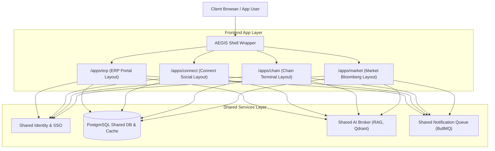

# AEGIS OS — Multi-App Super Platform Architecture Update

This blueprint outlines the production-grade system redesign of **AEGIS OS** as a Multi-App Super Platform. Each product (ERP Portal, AEGIS Connect, AEGIS Chain, and AEGIS Market) operates as a standalone application with independent layouts, navigation panels, components, and CSS color scopes while sharing authentication contexts, unified databases, notification queues, and core AI frameworks.

---

## 1. Super App Architecture

The system operates as a unified platform (Super App) coordinating separate tenant modules.



---

## 2. Multi-App Routing Structure (Next.js Layout Isolation)

To enforce independent layouts and themes without content leakage, we use Next.js **Route Groups** (`(erp)`, `(connect)`, `(chain)`, `(market)`) and custom configurations.

### Directory Structure:
```text
app/
├── (apps)
│   ├── (erp)
│   │   ├── layout.tsx         # ERP Sidebar Layout & Theme
│   │   └── page.tsx           # ERP Admin Dashboard
│   ├── (connect)
│   │   ├── layout.tsx         # Social Feed & Sidebar Layout
│   │   └── page.tsx           # Instagram/Discord Main Feed
│   ├── (chain)
│   │   ├── layout.tsx         # Blockchain Dark Terminal Layout
│   │   └── page.tsx           # Verifications & Block Explorer
│   └── (market)
│       ├── layout.tsx         # Bloomberg/TradingView Layout
│       └── page.tsx           # Quant Forecast Charts & Ticker
├── layout.tsx                 # Root HTML shell (injects fonts, shared provider)
└── page.tsx                   # SSO Entry / Redirect Gateway
```

---

## 3. App Switcher Component Specification

The **App Switcher** resides in the global header, enabling quick navigation across the platform's applications.

```
+────────────────────────────────────────────────────────┐
│  Search...                           [:: App Switcher] │
├──────────────────────────────────────┬─────────────────┤
│                                      │ [ ERP Portal ]  │
│                                      │ [ Connect ]     │
│                                      │ [ Chain ]       │
│                                      │ [ Market ]      │
└──────────────────────────────────────┴─────────────────┘
```

### React Component Implementation:
```tsx
// components/global/AppSwitcher.tsx
'use client';

import React, { useState } from 'react';
import Link from 'next/link';
import { Building2, MessageSquare, Blocks, TrendingUp, Brain, Grid } from 'lucide-react';

const apps = [
  { name: "ERP Portal", route: "/apps/erp", icon: Building2, desc: "University Operations Ledger" },
  { name: "AEGIS Connect", route: "/apps/connect", icon: MessageSquare, desc: "Campus Social & Chats" },
  { name: "AEGIS Chain", route: "/apps/chain", icon: Blocks, desc: "Web3 Trust & Credentials" },
  { name: "AEGIS Market", route: "/apps/market", icon: TrendingUp, desc: "Quant Market Prediction" }
];

export default function AppSwitcher() {
  const [isOpen, setIsOpen] = useState(false);

  return (
    <div className="relative">
      <button 
        onClick={() => setIsOpen(!isOpen)}
        className="p-2 bg-brand-bg-tertiary hover:bg-white/[0.04] rounded-xl border border-brand-border text-brand-text-muted hover:text-white cursor-pointer transition-all"
        title="Switch Applications"
      >
        <Grid className="w-5 h-5" />
      </button>

      {isOpen && (
        <div className="absolute right-0 top-full mt-2 w-80 bg-brand-bg-secondary border border-brand-border rounded-2xl shadow-2xl z-[999] p-3 animate-scale-up">
          <div className="text-[10px] font-bold text-brand-text-subtle uppercase tracking-wider pl-2 mb-2 pb-1.5 border-b border-brand-border/40">
            Switch Operating Space
          </div>
          <div className="grid grid-cols-1 gap-1.5">
            {apps.map((app) => (
              <Link 
                key={app.name} 
                href={app.route}
                onClick={() => setIsOpen(false)}
                className="flex items-center gap-3.5 p-2.5 rounded-xl hover:bg-white/[0.03] transition-all group"
              >
                <div className="p-2 bg-brand-primary/10 text-brand-primary rounded-lg group-hover:bg-brand-primary/20 transition-all">
                  <app.icon className="w-5 h-5 text-brand-primary" />
                </div>
                <div className="flex flex-col">
                  <span className="text-xs font-bold text-white leading-normal">{app.name}</span>
                  <span className="text-[9px] text-brand-text-subtle mt-0.5 leading-none">{app.desc}</span>
                </div>
              </Link>
            ))}
          </div>
        </div>
      )}
    </div>
  );
}
```

---

## 4. ERP Layout (University Operations)

The **ERP Layout** provides a navigation tree for managing university data.

```
┌────────────────────────────────────────────────────────┐
│  [Logo: AEGIS ERP] | Search...        [App Switcher] [👤]│
├─────────────┬──────────────────────────────────────────┤
│ - Students  │                                          │
│ - Faculty   │  Core Operations Workspace               │
│ - Courses   │  - KPI Cards Grid                        │
│ - Attendance│  - Operational Tables                    │
│ - Finance   │  - Registrar Audit Actions               │
│ - Settings  │                                          │
└─────────────┴──────────────────────────────────────────┘
```

*   **Design Tokens**: Standard light/dark themes using the base theme variable templates.
*   **Aesthetics**: Structured grids, clean tables, pagination bars, and minimal action cards.

---

## 5. AEGIS CONNECT Layout (Social Workspace)

The **Connect Layout** focuses on real-time messaging, social interaction, and media viewing.

```
┌────────────────────────────────────────────────────────┐
│  [Logo: CONNECT]  | Explore Search    [App Switcher] [👤]│
├─────────────┬───────────────────────────┬──────────────┤
│ - Home      │                           │ - Active     │
│ - Groups    │  Centered Social Feed     │   Voice/Video│
│ - Direct    │  - Stories Tray           │   Channels   │
│   Messages  │  - Post Cards             │              │
│ - Settings  │  - Comments Drawer        │ - Trending   │
└─────────────┴───────────────────────────┴──────────────┘
```

*   **Aesthetics**: Minimal sidebars, rounded story cards, reels drawers, call popups, and hover active states.
*   **Branding & Colors**: Social App Theme (using HSL values `#0D0D1E` background, `#17172E` surface, `#6366F1` active highlights).

---

## 6. AEGIS CHAIN Layout (Blockchain Console)

The **Chain Layout** presents a technical interface designed for data auditing.

```
┌────────────────────────────────────────────────────────┐
│  [Logo: CHAIN] | Tx / Block Search    [App Switcher] [👤]│
├─────────────┬──────────────────────────────────────────┤
│ - Overview  │                                          │
│ - SBTs      │  Dark Developer Terminal Viewport        │
│ - Contracts │  - Live Network Ticker (TPS / Latency)   │
│ - Explorer  │  - Hexadecimal Ledger Blocks             │
│ - Monitoring│  - Transaction Payload Prefabs           │
│ - Settings  │                                          │
└─────────────┴──────────────────────────────────────────┘
```

*   **Aesthetics**: Terminal typography, block maps, gas price gauges, status circles, and database search fields.
*   **Branding & Colors**: Blockchain Terminal Style (`#070E1A` background, `#0E1726` surface, `#10B981` active status green).

---

## 7. AEGIS MARKET Layout (Bloomberg Terminal Style)

The **Market Layout** acts as a data dashboard for portfolios and forecasts.

```
┌────────────────────────────────────────────────────────┐
│  [Logo: MARKET] | Ticker Query Search  [App Switcher] [👤]│
├─────────────┬───────────────────────────┬──────────────┤
│ - Markets   │                           │ - Portfolio  │
│ - Portfolios│  Technical Candlestick    │   Assets     │
│ - Signals   │  Canvas with SMA/EMA      │   Allocations│
│ - Watchlists│  overlays                 │              │
│ - Alerts    │                           │ - Buy/Sell   │
│ - Analytics │  AI Forecast Desks        │   Order Desk │
└─────────────┴───────────────────────────┴──────────────┘
```

*   **Aesthetics**: Dark layouts, index scrolling headers, canvas charting engines, and order entry fields.
*   **Branding & Colors**: Bloomberg Professional style (`#040814` background, `#0A1128` card widgets, `#F59E0B` active highlights).

---

## 8. Shared Services Architecture

Applications share cross-cutting concern services to maintain unified logic.

```
                       ┌─────────────────┐
                       │  SSO IAM Node   │ (JWT Key management)
                       └────────┬────────┘
                                │ (Authenticates)
                                ▼
 ┌───────────────┐      ┌───────────────┐      ┌───────────────┐
 │  Connect App  │ ───► │   Shared DB   │ ◄─── │   Chain App   │
 └───────────────┘      └───────┬───────┘      └───────────────┘
                                │ (Pipes)
                                ▼
                       ┌─────────────────┐
                       │ Kafka Event Bus │ (Event streams broker)
                       └─────────────────┘
```

---

## 9. Shared Authentication (Single Sign-On & JWT Sharing)

1.  **Shared Session**: The identity system stores session JWTs inside a secure cookie scoped to the parent domain (`.aegis.edu`).
2.  **Access token verification**: Individual layouts verify token signatures using a local cache of the SSO server's JWKS (JSON Web Key Set).

---

## 10. Shared AI Layer (RAG & Model Broker)

*   **Unified Model Interface**: Microservices query the central AI broker via high-speed gRPC channels, routing queries to local DeepSeek-R1 nodes.
*   **Shared Vector DB**: A single Qdrant vector database isolates embedding vectors using tenant domain indices.

---

## 11. Shared Notification Layer

*   **Event Mesh (Kafka)**: Microservices send events to standard Kafka topics (e.g., `aegis.notifications`).
*   **BullMQ Dispatcher**: Emitted events are queued, prioritized, and sent to client browsers via Socket.IO connections.

---

## 12. Kubernetes Deployment Architecture

Each application is deployed in a dedicated namespace with dedicated resource limits to ensure isolation.

```
                          API Gateway (Envoy proxy)
                                      │
           ┌──────────────────────────┼──────────────────────────┐
           ▼                          ▼                          ▼
   Namespace: erp             Namespace: connect         Namespace: chain
┌──────────────────────┐   ┌──────────────────────┐   ┌──────────────────────┐
│ • core-erp pods      │   │ • connect-social pods│   │ • chain-service pods │
│ • HPA CPU: 100-200%  │   │ • Socket.IO pods     │   │ • Ledger node pods   │
└──────────────────────┘   └──────────────────────┘   └──────────────────────┘
```

---

## 13. Microservice Architecture

Inter-service communication is optimized with gRPC contracts:

```protobuf
syntax = "proto3";

package aegis.superapp;

service IdentityProxy {
  rpc AuthenticateUser (AuthRequest) returns (AuthResponse);
  rpc VerifyPermissions (PermissionRequest) returns (PermissionResponse);
}

message AuthRequest {
  string session_jwt = 1;
}

message AuthResponse {
  bool is_valid = 1;
  string user_id = 2;
  string role = 3;
}

message PermissionRequest {
  string user_id = 1;
  string target_app = 2; // ERP, CONNECT, CHAIN, MARKET
  string action = 3;
}

message PermissionResponse {
  bool authorized = 1;
}
```

---

## 14. Database Architecture

*   **Shared DB schema (PostgreSQL)**: Enforces data logical isolation using RLS.
*   **Shared Cache Cluster (Redis)**: Keeps global session profiles and rate limit logs available to all front-end backends.

---

## 15. UI Component Architecture (Theme Matrix)

Different applications load customized CSS color scopes to distinguish their branding:

| Design Token | ERP Portal | AEGIS Connect | AEGIS Chain | AEGIS Market |
| :--- | :--- | :--- | :--- | :--- |
| `--bg-primary` | `#071126` | `#0D0D1E` | `#070E1A` | `#040814` |
| `--bg-secondary` | `#0B1736` | `#17172E` | `#0E1726` | `#0A1128` |
| `--bg-tertiary` | `#102043` | `#1F1F3D` | `#122035` | `#0F1B3A` |
| `--primary` | `#6366F1` | `#EC4899` | `#10B981` | `#F59E0B` |
| `--text-main` | `#FFFFFF` | `#FFFFFF` | `#10B981` | `#FFFFFF` |
| `--radius-lg` | `20px` | `12px` | `4px` (Angular) | `0px` (Terminal) |
