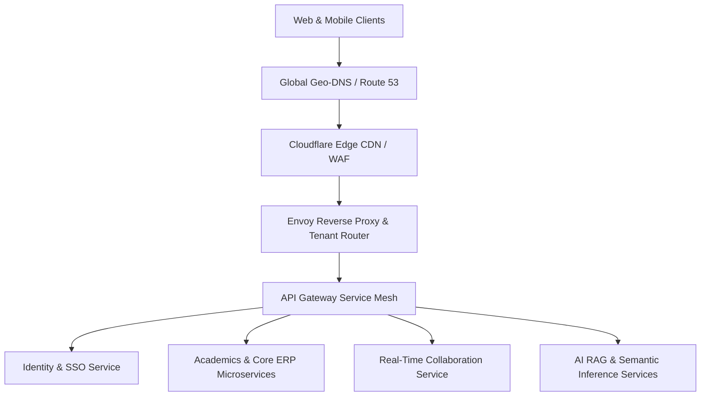
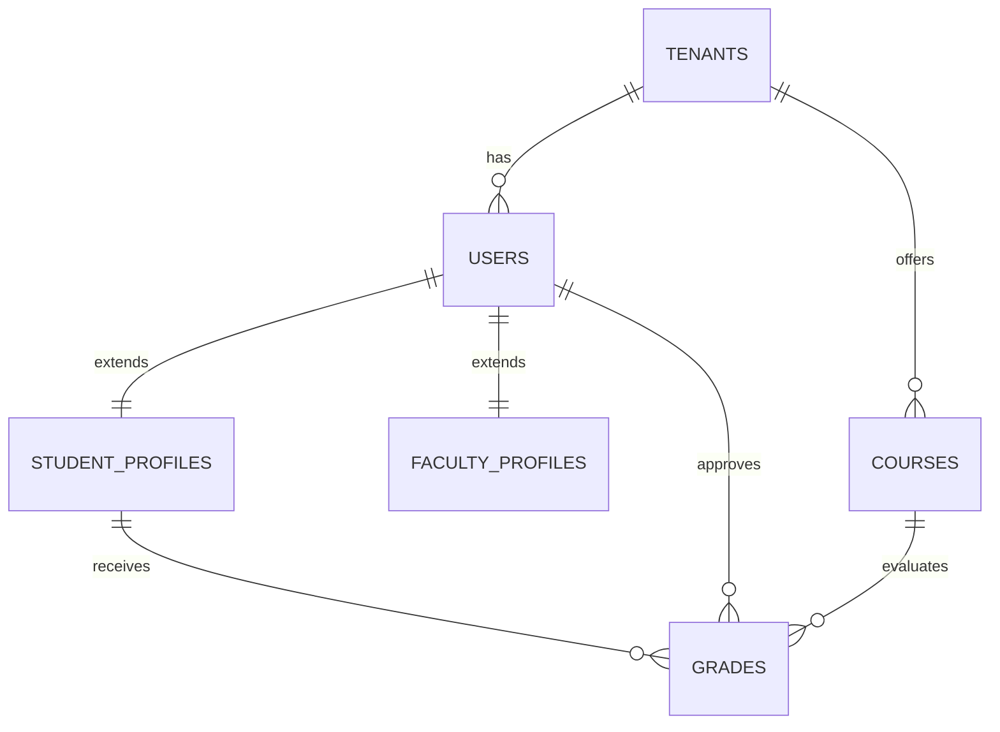
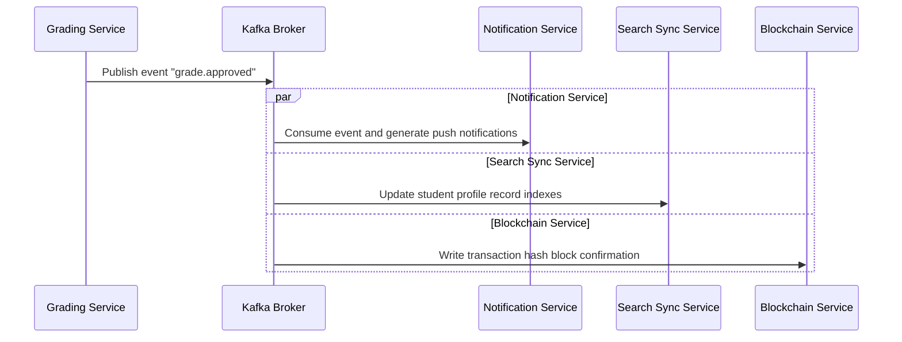
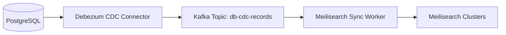
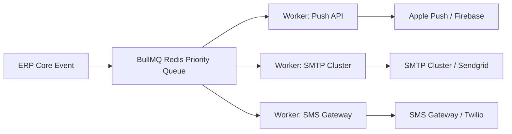

# Aegis University ERP Platform: 10x Architectural Design Blueprint
**Document Version:** 1.0.0-PROD  
**Authors:** ex-Google/Meta/Stripe/AWS Principal Architecture Group  
**Classification:** Enterprise System Specification

---

## Executive Summary & Design Philosophy
Traditional academic ERP systems are slow, monolithic, and struggle under heavy load (e.g., during course registration or exam result releases). Aegis University ERP is architected from the ground up as a **10x Scale Operating System** for global universities. It is designed to handle:
* **100,000+ Active Concurrent Students**
* **20,000+ Active Faculty & Staff**
* **Multi-Campus, Multi-University, Multi-Tenant SaaS topologies**
* **Sub-100ms API response latency, real-time sync, and offline-first edge operations**

---

## 1. Product Architecture

### High-Level Topology
The Aegis platform operates on a **Shared-Nothing, Cloud-Native, Multi-Tenant SaaS Topology**. It isolates tenants logically at the API layer while utilizing dedicated compute resources at the regional level.



### Tenant Routing Strategy
1. **Dynamic CNAME & Subdomain Resolution**: Host headers are parsed at the edge proxy (e.g., `mit.aegis.edu` or `custom-domain.com`).
2. **Context Injection**: The reverse proxy injects the `X-Tenant-ID` header into the incoming request context based on an edge lookup table cached in Redis.
3. **Onboarding Pipeline**: New tenants are provisioned via a Kubernetes Job that creates their schema/database, mints namespace namespaces, initializes Meilisearch indices, and sets up OAuth configurations.

---

## 2. Microservices Architecture

The platform is divided into domain-specific, loosely coupled microservices communicating via gRPC for synchronous actions and Apache Kafka for asynchronous workflows.

| Microservice | Primary Language | Storage Engine | Key Responsibility |
| :--- | :--- | :--- | :--- |
| **Identity Service** | NestJS / TypeScript | PostgreSQL + Redis | OAuth2, MFA, RS256 JWT minting, session registry |
| **Academic Registry** | NestJS / TypeScript | PostgreSQL | Course catalog, students, faculty profile registry |
| **Attendance Engine** | Go | Redis + PostgreSQL | Biometric, RFID, Geo-Fencing location validation |
| **Grading & Exams** | NestJS / TypeScript | PostgreSQL + Hyperledger | Result calculation, degree verification hashing |
| **Collaboration & Chat**| Node.js / TypeScript | MongoDB + MinIO | WebSocket connections, group/direct messaging |
| **Notification Engine** | Go | Redis | BullMQ job queue, transactional email, SMS, and Push |
| **AI Systems Broker** | Python | Qdrant Vector DB | Local LLM inference routing (Ollama), document chat RAG |
| **Search Sync** | Go | Meilisearch | Synchronizing Postgres states to Meilisearch index |

---

## 3. Database Design

### Tenant Isolation Levels
* **Tier 1 (Standard)**: Row-Level Security (RLS) on shared PostgreSQL schemas.
* **Tier 2 (Enterprise)**: Separate schema within a shared PostgreSQL database cluster.
* **Tier 3 (Mega-University/Sovereign)**: Fully isolated dedicated PostgreSQL instance.

### Base Database Schemas (DDL Specs)

```sql
-- Core Tenants Registry
CREATE TABLE tenants (
    id UUID PRIMARY KEY DEFAULT gen_random_uuid(),
    domain VARCHAR(255) UNIQUE NOT NULL,
    name VARCHAR(255) NOT NULL,
    tier VARCHAR(50) NOT NULL DEFAULT 'standard',
    status VARCHAR(50) NOT NULL DEFAULT 'active',
    config JSONB DEFAULT '{}'::jsonb,
    created_at TIMESTAMP WITH TIME ZONE DEFAULT CURRENT_TIMESTAMP
);

-- Users Registry (Tenant Isolated via RLS)
CREATE TABLE users (
    id UUID PRIMARY KEY DEFAULT gen_random_uuid(),
    tenant_id UUID NOT NULL REFERENCES tenants(id) ON DELETE CASCADE,
    name VARCHAR(255) NOT NULL,
    email VARCHAR(255) NOT NULL,
    password_hash VARCHAR(255) NOT NULL,
    mfa_secret VARCHAR(128),
    role VARCHAR(50) NOT NULL,
    status VARCHAR(50) NOT NULL DEFAULT 'active',
    avatar_url TEXT,
    created_at TIMESTAMP WITH TIME ZONE DEFAULT CURRENT_TIMESTAMP,
    UNIQUE(tenant_id, email)
);
ALTER TABLE users ENABLE ROW LEVEL SECURITY;
CREATE POLICY tenant_isolation_policy ON users 
    USING (tenant_id = current_setting('app.current_tenant_id')::uuid);

-- Student Profiles
CREATE TABLE student_profiles (
    id UUID PRIMARY KEY DEFAULT gen_random_uuid(),
    user_id UUID NOT NULL UNIQUE REFERENCES users(id) ON DELETE CASCADE,
    tenant_id UUID NOT NULL REFERENCES tenants(id) ON DELETE CASCADE,
    student_id_card VARCHAR(50) NOT NULL,
    gpa NUMERIC(3,2) DEFAULT 0.00,
    semester INT NOT NULL DEFAULT 1,
    attendance_rate NUMERIC(5,2) DEFAULT 0.00,
    guardian_metadata JSONB DEFAULT '{}'::jsonb,
    UNIQUE(tenant_id, student_id_card)
);
ALTER TABLE student_profiles ENABLE ROW LEVEL SECURITY;

-- Faculty Profiles
CREATE TABLE faculty_profiles (
    id UUID PRIMARY KEY DEFAULT gen_random_uuid(),
    user_id UUID NOT NULL UNIQUE REFERENCES users(id) ON DELETE CASCADE,
    tenant_id UUID NOT NULL REFERENCES tenants(id) ON DELETE CASCADE,
    faculty_id_card VARCHAR(50) NOT NULL,
    designation VARCHAR(100) NOT NULL,
    workload_hours INT DEFAULT 0,
    publications_count INT DEFAULT 0,
    UNIQUE(tenant_id, faculty_id_card)
);
ALTER TABLE faculty_profiles ENABLE ROW LEVEL SECURITY;

-- Courses Table
CREATE TABLE courses (
    code VARCHAR(50) PRIMARY KEY,
    tenant_id UUID NOT NULL REFERENCES tenants(id) ON DELETE CASCADE,
    title VARCHAR(255) NOT NULL,
    credits INT NOT NULL DEFAULT 3,
    max_enrollment INT NOT NULL DEFAULT 60,
    status VARCHAR(50) NOT NULL DEFAULT 'active'
);
ALTER TABLE courses ENABLE ROW LEVEL SECURITY;

-- Grades Log (Audit Compliant)
CREATE TABLE grades (
    id UUID PRIMARY KEY DEFAULT gen_random_uuid(),
    tenant_id UUID NOT NULL REFERENCES tenants(id) ON DELETE CASCADE,
    student_id UUID NOT NULL REFERENCES student_profiles(id),
    course_code VARCHAR(50) NOT NULL REFERENCES courses(code),
    marks NUMERIC(5,2) NOT NULL,
    grade VARCHAR(5) NOT NULL,
    semester INT NOT NULL,
    approved_by UUID REFERENCES users(id),
    ledger_tx_hash VARCHAR(66) UNIQUE,
    created_at TIMESTAMP WITH TIME ZONE DEFAULT CURRENT_TIMESTAMP
);
ALTER TABLE grades ENABLE ROW LEVEL SECURITY;
CREATE INDEX idx_grades_student_course ON grades(tenant_id, student_id, course_code);
```

---

## 4. ER Diagram



---

## 5. API Contracts

### gRPC Service Definition: Grades
Used for high-throughput inner-service communication during semester result publishing.

```protobuf
syntax = "proto3";

package aegis.grades;

service GradeService {
    rpc SubmitGrade (GradeSubmissionRequest) returns (GradeSubmissionResponse);
    rpc VerifyDegreeCredentials (DegreeVerificationRequest) returns (DegreeVerificationResponse);
}

message GradeSubmissionRequest {
    string tenant_id = 1;
    string student_id = 2;
    string course_code = 3;
    float marks = 4;
    string grader_id = 5;
}

message GradeSubmissionResponse {
    string grade_id = 1;
    string assigned_letter = 2;
    bool sync_status = 3;
    string ledger_tx_hash = 4;
}

message DegreeVerificationRequest {
    string degree_hash = 1;
}

message DegreeVerificationResponse {
    bool is_verified = 1;
    string student_name = 2;
    string graduation_date = 3;
    string university_name = 4;
}
```

---

## 6. OpenAPI Documentation (YAML Snippet)

```yaml
openapi: 3.0.3
info:
  title: Aegis University core API
  version: 1.0.0
paths:
  /api/v1/auth/login:
    post:
      summary: Tenant-aware authenticate endpoint
      requestBody:
        required: true
        content:
          application/json:
            schema:
              type: object
              properties:
                email:
                  type: string
                password:
                  type: string
                tenant_domain:
                  type: string
              required: [email, password, tenant_domain]
      responses:
        '200':
          description: Access and refresh JWT tokens returned
          content:
            application/json:
              schema:
                type: object
                properties:
                  accessToken:
                    type: string
                  refreshToken:
                    type: string
                  expiresIn:
                    type: integer
  /api/v1/grades/approve:
    post:
      summary: HOD grade bundle approval
      security:
        - BearerAuth: []
      requestBody:
        required: true
        content:
          application/json:
            schema:
              type: object
              properties:
                courseCode:
                  type: string
                gradeIds:
                  type: array
                  items:
                    type: string
      responses:
        '200':
          description: Grades approved and queued for blockchain anchoring
```

---

## 7. Folder Structure (Turbo Monorepo)

Aegis is organized as a high-performance monorepo for codebase consistency.

```text
aegis-universe-erp/
├── apps/
│   ├── web-portal/           # Next.js 15 Tailwind Frontend
│   └── docs-portal/          # OpenAPI interactive portal
├── services/
│   ├── identity-service/     # NestJS Identity service
│   ├── academic-service/     # NestJS Academic service
│   ├── chat-service/         # Node/Socket.IO Chat server
│   └── blockchain-service/   # Solidity compile & RPC anchor broker
├── packages/
│   ├── ts-config/            # Shared Typescript configs
│   ├── db-client/            # Shared Prisma Client and DB isolation helper
│   └── dtos/                 # Common API Interfaces & gRPC bindings
├── k8s/                      # Kubernetes Orchestrations
└── docker-compose.yml
```

---

## 8. Component Structure (Next.js 15)

The frontend is structured to maximize code reusability and optimize bundle size:

```text
apps/web-portal/
├── app/
│   ├── (auth)/login/
│   ├── (dashboard)/
│   │   ├── admin/
│   │   ├── student/
│   │   └── hod/
│   ├── api/
│   └── layout.tsx
├── components/
│   ├── ui/                   # Shadcn raw components (Buttons, Modals)
│   ├── shared/
│   │   ├── sidebar.tsx       # 280px Wide responsive layout sidebar
│   │   └── navbar.tsx        # Search-integrated header shell
│   └── analytics/            # High-performance charts (ChartJS/Vis)
└── store/
    ├── auth-store.ts         # Zustand JWT session management
    └── chat-store.ts         # Zustand SocketIO client handler
```

---

## 9. Event Driven Architecture

The asynchronous backbone of Aegis is powered by Apache Kafka, ensuring microservices function independently without cascading failures.



### Key Topics & Payload Schemas
* **Topic Name**: `academics.grade.approved`
* **Partitioning Key**: `tenant_id`
* **Schema**:
```json
{
  "$schema": "http://json-schema.org/draft-07/schema#",
  "title": "GradeApprovedEvent",
  "type": "object",
  "properties": {
    "event_id": { "type": "string", "format": "uuid" },
    "tenant_id": { "type": "string", "format": "uuid" },
    "student_id": { "type": "string", "format": "uuid" },
    "course_code": { "type": "string" },
    "letter_grade": { "type": "string" },
    "approver_id": { "type": "string", "format": "uuid" },
    "timestamp": { "type": "string", "format": "date-time" }
  },
  "required": ["event_id", "tenant_id", "student_id", "course_code", "letter_grade", "timestamp"]
}
```

---

## 10. Redis Strategy

To meet the sub-100ms response requirements, Redis is implemented in multi-mode clusters.

### Caching Layers & Policies
1. **Session & Auth Caching**: Stores access tokens linked to user IDs (TTL: 15 minutes).
2. **API Query Caching**: Database outputs for heavy read queries (e.g., student roster listings) are cached with custom tags (TTL: 1 hour, evicted on update events).
3. **Rate Limiting**: Implements Redis-based sliding window algorithms.

```text
Rate-Limit Key Pattern: rate_limit:{TenantId}:{UserId/IP}:{Endpoint}
E.g., rate_limit:usr_001:POST:/api/v1/auth/login -> Value: Hits Count (TTL: 60s)
```

### Socket.IO Scaling Backplane
When scaling chat microservices to multiple containers, Socket.IO matches messages using a Redis Pub/Sub adapter to ensure messages reach connected users across different pod instances.

---

## 11. Search Architecture

Search query indexing must be lightning-fast, secure, and isolated at the tenant boundary.



### Multi-Tenant Index Isolation
* Separate Meilisearch indexes are constructed for each tenant (e.g., `tenant-uuid-students`, `tenant-uuid-courses`).
* Search queries from the frontend are signed with scoped security API keys, preventing cross-tenant document leakage.

---

## 12. AI Architecture

Aegis implements an **On-Premise/Self-Hosted Private AI Gateway** utilizing Ollama to host lightweight models locally.

### Vector Store Schema (Qdrant)
* **Collection Name**: `aegis_knowledge_base`
* **Vector Dimension**: 1536 (using `nomic-embed-text`)
* **Payload Fields**:
```json
{
  "tenant_id": "uuid",
  "document_id": "uuid",
  "category": "academic_policies / syllabi / student_handbook",
  "content": "raw textual chunks",
  "acl_roles": ["student", "faculty", "admin"]
}
```

### RAG pipeline
1. User queries the ERP Assistant: "When is the deadline to appeal my CS101 grade?"
2. System looks up the query vector embedding.
3. Retrieves relevant chunks matching `tenant_id` and `acl_roles` from Qdrant.
4. Inject context into the LLM prompt (Ollama / Llama-3-8B) for generating answers.

---

## 13. Chat Architecture

The real-time collaboration suite replaces public networks (e.g., WhatsApp) with a secure workspace.

### WebSocket Clustering & Persistence Strategy
* **Transport**: Engine.io / WebSockets clustered behind Envoy load balancers.
* **Database Strategy**: Read-heavy operations query MongoDB (document schema for messages and threads).
* **Write-behind caching**: Incoming receipts and typing states are registered in Redis and synced to MongoDB in batches every 5 seconds to reduce write loads.

---

## 14. Notification Architecture

To execute thousands of notifications concurrently without blocking runtime threads, a message dispatch queue is built using BullMQ.



---

## 15. Kubernetes Deployment

Production workloads run inside isolated Kubernetes namespaces, managing infrastructure resource limits precisely.

```yaml
apiVersion: apps/v1
kind: Deployment
metadata:
  name: academics-service
  namespace: aegis-prod
spec:
  replicas: 4
  selector:
    matchLabels:
      app: academics-service
  template:
    metadata:
      labels:
        app: academics-service
    spec:
      containers:
        - name: service-container
          image: aegis-registry.internal/academics:v1.0.0
          resources:
            limits:
              cpu: "1"
              memory: 2Gi
            requests:
              cpu: "500m"
              memory: 1Gi
          ports:
            - containerPort: 50051
          readinessProbe:
            grpc:
              port: 50051
            initialDelaySeconds: 5
            periodSeconds: 10
---
apiVersion: autoscaling/v2
kind: HorizontalPodAutoscaler
metadata:
  name: academics-hpa
  namespace: aegis-prod
spec:
  scaleTargetRef:
    apiVersion: apps/v1
    kind: Deployment
    name: academics-service
  minReplicas: 4
  maxReplicas: 20
  metrics:
    - type: Resource
      resource:
        name: cpu
        target:
          type: Utilization
          averageUtilization: 75
```

---

## 16. CI/CD Pipeline

The CI/CD pipeline ensures automated quality checks and zero-downtime rolling updates.

```yaml
name: Aegis CI/CD Production Pipeline

on:
  push:
    branches: [ main ]

jobs:
  validate-and-build:
    runs-on: ubuntu-latest
    steps:
      - uses: actions/checkout@v3
      
      - name: Setup Node environment
        uses: actions/setup-node@v3
        with:
          node-version: 18
          cache: 'npm'

      - name: Install Dependencies
        run: npm ci

      - name: Run Linters & Audits
        run: npm run lint

      - name: Run Unit & Integration Tests
        run: npm run test:cov

      - name: Run Security Container Scan (Trivy)
        uses: aquasecurity/trivy-action@master
        with:
          image-ref: 'aegis-registry.internal/academics:${{ github.sha }}'
          format: 'table'
          exit-code: '1'
          ignore-unfixed: true
          severity: 'CRITICAL,HIGH'

      - name: Deploy to K8s Namespace (ArgoCD GitOps Sync Trigger)
        run: |
          git config --global user.email "gitops@aegis.edu"
          git config --global user.name "GitOps Bot"
          git clone https://github.com/aegis-edu/gitops-infra.git
          cd gitops-infra
          sed -i 's/imageTag:.*/imageTag: "${{ github.sha }}"/g' values-prod.yaml
          git add values-prod.yaml
          git commit -m "chore(deploy): upgrade academics-service to ${{ github.sha }}"
          git push origin main
```

---

## 17. Security Architecture

1. **JWT Signature Schema**: Handled using **RS256** asymmetric keys. Public keys are exposed via local JSON Web Key Sets (JWKS) to enable decentralized signature verification.
2. **SSO Core Integration**: Integrates with federated OAuth2 portals (OpenID Connect for Google Workspace and Microsoft Entra ID).
3. **Casbin RBAC Matrix Definition**:
```csv
# Policy Rules
p, admin, users, read
p, admin, users, write
p, hod, grades, approve
p, faculty, grades, write
p, student, grades, read

# Role Inheritance Rules
g, hod, faculty
```

---

## 18. Monitoring & Observability Architecture

* **Instrumentation**: OpenTelemetry agents inject trace headers throughout microservice calls.
* **Logging System**: Fluentbit agents collect container logs and stream them to OpenSearch clusters.
* **Prometheus Alerting Rules**:
```yaml
groups:
  - name: aegis-critical-alerts
    rules:
      - alert: HTTP5xxSpike
        expr: rate(http_requests_total{status=~"5.."}[5m]) > 0.05
        for: 2m
        labels:
          severity: critical
        annotations:
          summary: "Spike in HTTP 5xx errors detected for tenant: {{ $labels.tenant_id }}"
```

---

## 19. Scalability Plan

* **Write Scaling (PostgreSQL)**: Main database operates in write-active configurations with asynchronous streaming replication to two geographic read-replicas. PgBouncer pool brokers maintain a target connection count.
* **Global Edge Acceleration**: Assets are cached near user locations via Cloudflare CDN. Dynamic API calls bypass cache targets but leverage Cloudflare Argo Smart Routing to reduce round-trip latencies.

---

## 20. Production Readiness Checklist

Before moving live with a new university tenant, verify all checklist entries:

- [ ] **Data Encryptions**: Confirm database tables are encrypted (AES-256 at rest) and TLS 1.3 is forced on all external ingress endpoints.
- [ ] **MFA Enforcement**: Confirm administrative accounts require hardware or TOTP authentication keys.
- [ ] **Meilisearch Scoped API keys**: Validate index access rules to verify search tokens are tenant-isolated.
- [ ] **Backup Executions**: Ensure PG Backups run hourly and save encrypted snapshots into secure storage buckets.
- [ ] **Disaster Recovery**: Confirm failover recovery exercises completed under 15 minutes of recovery objective limits.
